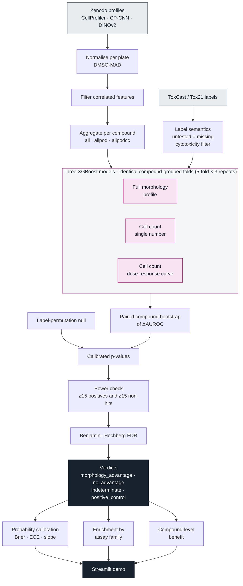

# beyond-the-count

**Does Cell Painting see more than a cell count?** A statistical audit that tells toxicology teams where image-based morphology profiles add real information beyond a simple cell-count baseline.

**Live demo:** https://beyond-the-count1.streamlit.app/

[](https://github.com/dhairya-pandya/beyond-the-count/actions/workflows/keep-alive.yml)

## Problem

Cell Painting stains cells with six fluorescent dyes, images them in five channels, and measures thousands of shape, texture and intensity features per cell. It is becoming a core method for human-relevant, animal-free toxicology, and regulators now ask for clear technical characterisation of such assays.

Many toxicity labels are linked to how many cells survive a treatment. A model that knows cell counts alone can therefore score well on those labels, which makes it hard to tell whether a morphology model is reading morphology or reading density. Teams need a repeatable way to answer, endpoint by endpoint: **what does the full morphology profile add beyond cell count?**

## Solution

`cpsa` (Cell Painting Shortcut Audit) is a reusable, dataset-agnostic audit. For every assay endpoint it compares three models on identical compound-grouped folds and returns one of four verdicts:

| verdict | meaning |
|---|---|
| `morphology_advantage` | the full profile beats the cell-count baseline, certified after multiple-testing correction |
| `no_advantage` | no detectable advantage: with enough data to compare, the cell-count baseline does as well |
| `indeterminate` | the endpoint needs more positive compounds before a claim is possible |
| `positive_control` | the cell-count endpoint itself, which the cell-count model solves by construction |

Applied to the public primary human hepatocyte data of Ewald et al. (*Cell Systems* 2026; 1,085 compounds, 405 endpoints from ToxCast/Tox21 plus the study's own readouts), the audit certifies 15 endpoints for morphology among the 181 that have enough data, including the metabolic-activity readout (MT) in all three image representations. Morphology adds the most information for compounds that alter cells while leaving them in place (+0.15 ranking benefit).

Everything runs on a laptop CPU with fixed seeds and MD5-verified downloads. Data: profiles on Zenodo ([10.5281/zenodo.17067683](https://zenodo.org/records/17067683), CC-BY 4.0) and labels from the authors' [analysis repo](https://github.com/jessica-ewald/2024_09_09_Axiom_OASIS) (BSD-3-Clause).

**Try it**

```bash
python3.12 -m venv .venv && .venv/bin/pip install -r requirements.txt && .venv/bin/pip install -e .
.venv/bin/streamlit run demo/app.py        # precomputed results are included in results/
```

To rebuild the results from the raw data, run the numbered scripts in `scripts/` in order (`01_download_zenodo_data.py` to `15_calibrate_verdicts.py`), or `scripts/20_full_audit.sh` for the full three-representation audit.

## Architecture



| stage | module |
|---|---|
| normalisation, feature filtering, per-compound aggregation (`all` / `allpod` / `allpodcc`) | `cpsa.data.preprocess` |
| label loading and semantics | `cpsa.data.load_labels`, `cpsa.data.label_context` |
| the three models, grouped cross-validation, bootstrap of ΔAUROC | `cpsa.models` |
| permutation null and calibrated p-values | `cpsa.audit`, `cpsa.stats.null_calibration` |
| power check, BH-FDR, verdict assignment | `cpsa.stats.multiple_testing` |
| calibration of predicted probabilities (Brier, ECE, slope) | `cpsa.stats.calibration` |
| enrichment by target family, assay design, cell type | `cpsa.biology.enrichment` |
| compound-level benefit and compound classes | `cpsa.biology.compound_classes` |
| simulation with known ground truth | `cpsa.simulate` |
| public API | `cpsa.api` (`shortcut_audit`, `permutation_null`) |

Repository layout: `src/cpsa/` package, `scripts/` numbered pipeline stages, `tests/` unit tests, `demo/` Streamlit app, `docs/` problem statement and plan, `report/` technical report and write-up, `results/` generated outputs.

## Improvements

Compared with a standard "morphology versus the single cell-count number" benchmark, the audit adds:

- **A stronger comparator.** The cell-count baseline sees the whole dose–response curve (eight concentrations, minimum, area under the curve, cell-count POD), so any advantage reflects information beyond cell count.
- **Calibrated statistics.** Bootstrap p-values are calibrated against an empirical label-permutation null run at the audit's own settings, so the certified count matches its nominal significance level (2.6% at a nominal 5% on held-out runs).
- **Power-aware verdicts.** Endpoints with at least 15 positives and 15 non-hits get a verdict, and the rest are marked `indeterminate`, so every reported number is backed by enough data.
- **Multiple-testing control.** Benjamini–Hochberg FDR across all powered endpoints, valid under the positive dependence that endpoints sharing compounds and assays display.
- **Label-aware data handling.** Untested compound–endpoint pairs stay missing, and the cytotoxicity filter is respected where it applies.
- **A nested test of added value.** A model that sees morphology and the cell-count curve is compared with cell count alone, with its own permutation null; it certifies 23 endpoints, including all 15 from the main audit. A regularised logistic regression confirms the signal holds for a linear model as well.
- **Detectable-effect reporting.** Every endpoint shows the smallest AUROC advantage its data can detect, and "no detectable advantage" is read alongside it.
- **Assay-aware enrichment.** Enrichment p-values come both as a Fisher test and as a permutation over whole assays, so correlated endpoints from one assay count once.
- **Three image representations.** CellProfiler, CP-CNN and DINOv2, each with its own matched null; 8 endpoints are certified under all three.
- **Robustness checks.** Aggregation rules, chemical-similarity folds, a plate/well/batch probe, and a simulation with known ground truth all support the same conclusions.
- **Compound-level explanation.** A ranking-benefit decomposition shows which compounds gain from morphology, plus enrichment by assay and target family.
- **Organ-on-chip planning.** A simulation at 20 to 200 compounds shows what the audit concludes at chip scale, why folds are grouped by compound when compounds are replicated over chips, and how many compounds a design needs to detect a given advantage; the demo's Organ-on-chip tab turns this into a study planner and a checklist for labels, a 3D cell-count baseline, features, grouping and sample size.
- **A second morphology source.** EU-OPENSCREEN HepG2 profiles (four imaging sites) run through the same audit on 327 shared compounds agree on MT and show how much a verdict count depends on baseline strength and sample size.
- **Calibrated probabilities and an interactive demo.** Per-endpoint reliability diagrams, recalibrated compound predictions, and a plate-map view of all 405 endpoints.

Next steps: apply the audit to organ-on-chip datasets, add donor and time-point dimensions as data becomes available, and add a density-residualised comparator for an even sharper separation of morphology from cell count.
