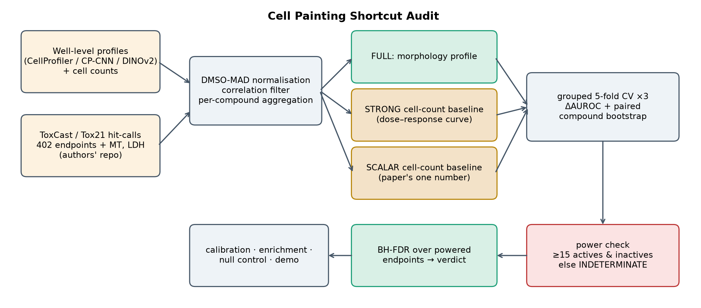
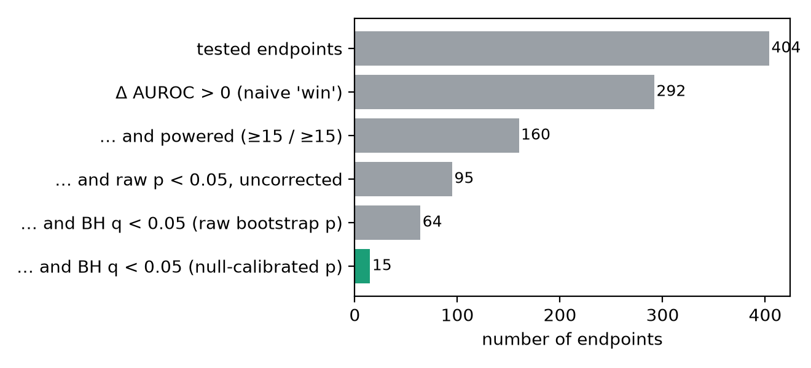
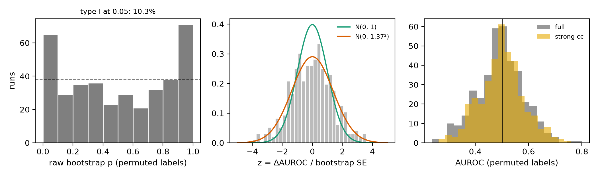

# The Cell Painting Shortcut Audit — what problem we are working on and what we are trying to solve

*A deep problem statement for the team (biology and ML), written 3 October 2026, seven days before the 10 October deadline.*

---

## 0. How to read this document

This document answers four questions in order: **why does this problem exist** (§1–3), **what exactly are we trying to decide, scientifically and statistically** (§4–5), **what have we built and found so far** (§6–7), and **how did we get here and what is left** (§8–12). It is meant to be read by someone who knows biology but not machine learning, or the reverse. A glossary (§13) and a question-and-answer section for non-ML readers (§14) are at the end.

Every factual statement carries one of three provenance levels:

| tag | meaning |
|---|---|
| **[verified]** | checked directly by us — in the data files, in our own code and results, or in a primary source we opened |
| **[chat]** | stated in the planning conversation (the shared Claude chat) and *not* independently re-checked by us |
| **[ours]** | our reasoning, interpretation or design decision — arguable, and marked as such |

Results carry one of three status levels: **final** (computed with the final code on the final data), **preliminary** (computed, but will be recomputed in the full three-representation audit that comes next), and **planned** (designed or implemented but not yet run).

**A note on the planning chat.** The chat (https://claude.ai/share/057d4d81-f307-4f2b-aa1e-8eef3d6fea0b) is a *frozen snapshot*: when I re-read it today it contained exactly the same 16 exchanges as before (ending with the PowerShell `curl` exchange), differing only in relative timestamps. The first message of the chat contained a pasted "brainstorming summary" that the share view hides ("Files hidden when shared"); what it contained can only be inferred from the replies (§9). If the chat was continued after it was shared, a new share link is needed for me to see the continuation.

---

## 1. The problem in one paragraph

Regulators and pharmaceutical companies are trying to replace animal toxicology with human-relevant laboratory methods called **new approach methodologies (NAMs)**. One of the most promising is **Cell Painting**: stain cells with fluorescent dyes, photograph them, and turn each image into thousands of numbers describing cell shape and texture. A machine-learning model can then read these numbers and predict whether a chemical is toxic or biologically active. The trouble is a well-documented failure mode: much of toxicity is, at bottom, *cells dying*, and **a model that merely counts how many cells survived** — no shape, no texture, no biology — can score surprisingly well on exactly these tasks. If a sophisticated morphology model does not beat that trivial counting model, it has shown nothing. Yet in practice nobody systematically checks, endpoint by endpoint, whether the morphology model really beats the counting model, and checking properly is statistically delicate: there are hundreds of endpoints (so some "wins" occur by chance), many endpoints have almost no positive examples (so any number is noise), and the usual way of attaching a p-value to a win turns out to be wrong. **We are building a statistically rigorous, reusable audit that, for every assay endpoint, answers three questions: (1) does the full morphological profile beat a cell-count-only baseline after correcting for the number of endpoints tested; (2) is there enough data to even say; and (3) where morphology wins, is there a biologically coherent reason?**

## 2. The question, stated as simply as possible

> *When a Cell Painting model predicts a toxicity or bioactivity label, is it reading the cells' shape and texture — or only counting how many cells are left?*

Everything else in this document is a way of answering that question honestly, endpoint by endpoint, with known error rates.

---

## 3. Background, in layers

### 3.1 Why toxicology is changing (the regulatory and scientific push)

- Animal testing is slow, expensive, ethically contested, and imperfectly predictive of human effects. Regulators and industry have therefore been encouraging **NAMs**: in-vitro assays, computational models and "organ-on-a-chip" systems that use human cells. **[verified]** The US FDA published a draft guidance on 19 March 2026 (Federal Register document 2026-05390), *"General Considerations for the Use of New Approach Methodologies in Drug Development"*, which names four factors a sponsor should address when validating a NAM: **context of use, human biological relevance, technical characterization, and fit for purpose**. (We confirmed the title, date and the four factors from search results and the Federal Register listing; we could not open the page itself.)
- **[chat]** The chat adds that, as of January 2026, no organ-chip tool had been fully qualified through FDA's ISTAND pathway, and cites a US GAO finding that experts judged only 10–20 % of purchased human cells to be of sufficient quality for organ-chip studies. Neither figure was re-checked by us.
- The significance for us: *technical characterization* and *fit for purpose* are precisely the questions "is this assay's predictive power real, and for which purpose?" An audit that distinguishes real signal from a trivial confound is a direct instance of technical characterization.
- **Organ-on-a-chip (OoC)** is the competition's stated interest. Chips are microfluidic devices in which living human cells form tissue-like structures; they are imaged, and the images are analysed by AI. **[ours]** The same shortcut risk applies to any image-based chip readout, which is why we position the work as a *validation method* that chip assays should adopt — while stating plainly that our data are 2D plate cultures, not chips.

### 3.2 Image-based profiling and Cell Painting, step by step

**Cell Painting** is a standardised microscopy assay for taking a "morphological fingerprint" of cells.

1. **Culture and treat.** Cells are grown in multi-well plates (here 384-well) and exposed to a chemical at one of several concentrations for a set time (here 44 hours). **[verified]**
2. **Stain.** Fluorescent dyes label different cell compartments. The standard protocol uses six dyes imaged in five fluorescence channels covering nucleus (DNA), nucleoli/cytoplasmic RNA, endoplasmic reticulum, mitochondria, and the actin/Golgi/plasma-membrane group. **[verified]** In our data the CellProfiler feature names carry exactly these channel tags: `DNA`, `RNA`, `ER`, `Mito`, `AGP` (actin–Golgi–plasma membrane), plus a `Brightfield` channel.
3. **Image.** Each well is photographed at several sites. **[verified]** The image index lists about 2.0 million image files across 336,557 well–site records and six channels.
4. **Measure.** Software extracts features per cell — size, shape, intensity, texture, how the stains overlap, neighbour relationships — then aggregates them per well. **[verified]** For this dataset the authors computed profiles three ways: **CellProfiler** (classical, hand-engineered; 5,640 raw features), **CP-CNN** (a convolutional network trained on Cell Painting; 672 features) and **DINOv2** (a general-purpose vision transformer with no cell-specific training; 4,608 features).
5. **Normalise.** Every plate has DMSO (solvent) control wells; features are centred and scaled against them to remove plate-to-plate drift. **[verified]** (We re-implemented this from the authors' code.)
6. **Aggregate per compound.** The 8 concentrations × 2 replicates per compound are averaged (all wells, wells above the compound's point of departure, or wells in a window between two points of departure). The result is **one profile vector per compound**. **[verified]**

Why it is attractive: it is cheap, scalable, makes no assumption about a compound's mechanism, and its profiles are rich enough that compounds acting in similar ways look alike. That makes it useful for mechanism-of-action analysis, for detecting bioactivity earlier than cell death, and for toxicity prediction.

**The key side-product: cell count.** Because the software segments every cell, the number of cells per well comes for free. It is a one-number summary of how many cells survived.

### 3.3 The dataset: the Axiom OASIS hepatocyte screen (Ewald et al., *Cell Systems*, 2026)

**[verified]** Ewald, J.D. et al., *Cell Painting for cytotoxicity and mode-of-action analysis in primary human hepatocytes*, Cell Systems 17(5), 101566 (2026), doi:10.1016/j.cels.2026.101566 (bioRxiv preprint January 2025; accepted 25 February 2026 per the chat **[chat]**).

| aspect | what the study did |
|---|---|
| cells | **primary human hepatocytes** (liver cells taken from a donor, not an immortalised line); 2D cultures in 384-well plates |
| compounds | **1,085** chemicals — pharmaceuticals, pesticides, industrial chemicals, food additives — chosen because in-vivo hepatotoxicity data exist for them **[chat]** |
| design | 8 concentrations (about 0.01–100 µM), 2 replicates, 44 h exposure |
| readouts per well | **LDH** (an enzyme released when cell membranes rupture — a late-death marker); **MT / RealTime-Glo** (metabolic activity — an earlier stress marker); **Cell Painting**; and **cell count** extracted from the images |
| outside labels | binary hit-calls for **402 ToxCast/Tox21 endpoints** in three groups: 292 *cell-based* assays (specific biology in cell lines), 72 *cell-free* assays (purely biochemical: a protein or enzyme in a tube), 38 *cytotoxicity* columns (cell-type / tissue summaries where 1 = cytotoxic; the paper's 48 is before a minimum-5-positive / 5-negative filter — see §3.3b) **[verified]** |
| data on Zenodo | 865 MB: profiles (three representations), metadata, an image index — all CC-BY 4.0. The raw images (≈650 TB **[chat]**) live in the public Cell Painting Gallery and are **not** needed. **[verified]** |
| code and labels | the authors' GitHub repository (BSD-3-Clause) contains the ToxCast binary labels, endpoint annotations (assay design, target family, cell line, tissue), and supplementary tables with the paper's hit calls and points of departure **[verified]** |

What we actually model **[verified]**: 21,456 wells on 65 plates (4,849 DMSO controls), aggregated to **967 compounds** with a profile; after joining labels there are **405 endpoints** (292 + 72 + 38 + the paper's MT, LDH and cell-count hits), of which one (cell count) is used as a positive control.

### 3.3b How the ToxCast labels are built, and what a 0 means *(from the team's label audit; supersedes any earlier reading)*

Source: `0_prepare_data/3B_extract_invitrodb.ipynb` in the OASIS repository and the authors' Methods, relayed by a teammate and **checked by us against the repository files** **[verified where marked]**.

1. **Definition.** A cell-based label is a **hit** if the ToxCast `hitcall > 0.9`. It is then **set to 0** if the endpoint's AC50 is more than half of the *matched consensus cytotoxicity AC50* (cell-type match, tissue fallback). Interpretation: hits that look like cytotoxicity are removed.
2. **The filter is only partial.** The consensus cytotoxicity AC50 exists only if at least 20 % of the compound's matched viability tests fired, and it is dropped if above 100 µM. Where it does not exist the filter never applies. **[verified]** about 65 % of cell-based records (64.6 %) have no matched cytotoxicity AC50. Where the filter applied it cut cell-based positives from 17,110 to 8,400 **[verified: 8,400 ones in the binary matrix]**. So many cell-based labels are **not** cytotoxicity-adjusted, and a cell-count shortcut can reach them.
3. **A 0 is not "tested and negative".** It can mean no hit, a hit overridden by the filter, or a tie between duplicate records (ties go to no hit). We therefore call the 0-class **"non-hit"** in this document (the code and the `n_inactive` column keep the older name). In the **38 cytotoxicity columns the meaning flips: 1 = cytotoxic in that cell type or tissue**; they are cell-type/tissue summaries, not individual assays (the paper's 48 is *before* a minimum-5-positive / 5-negative filter — this resolves our earlier "38 vs 48" discrepancy).
4. **Missing is not zero.** **[verified]** 107,103 of 281,196 cells of the cell-based matrix are observed (61.9 % missing; 144,203 info rows vs 195,640 possible pairs). Absent pairs stay missing and every endpoint is scored only on its tested compounds; a regression test pins these counts.
5. **One label definition.** Labels come only from the repository's `*_binary.parquet` files. The `hitcall` column of the `*_info` files is the raw continuous value and is never used as a label; we read only the `cytotox_*` columns of the info files, and only to ask *whether the filter could apply* to a compound–endpoint pair.
6. **Coverage.** **[verified]** 670 of the profiled compounds have cytotoxicity and cell-based labels; 242 profiled compounds have at least one cell-free label (the teammate's count is 251; the difference is under investigation); the 119 anonymised compounds can be used only for the native readouts (LDH, MT, cell count).
7. **Irregular design.** **[verified]** Concentration series differ by source batch: 952 compounds share one 8-point series (0.0456–100 µM), 14 use a 100× lower series (0.0091–20 µM), one has 7 points. Replicates vary: 829 compound-concentration cells have a single well, 6,850 have two, a few have four or six. Consequences in our code: dose-response baseline features now include **concentration-interpolated** cell-count values (0.1, 1, 10, 100 µM; NaN where not tested) next to the rank-based ones, and the technical probe includes the number of wells, the minimum wells per concentration and the top concentration.

**What this means for the audit.** The verdict logic treats 0 as the negative class of an AUROC; the correct reading is "not a (filtered) hit". For cell-based endpoints, the shortcut question therefore splits in two: for pairs where the cytotoxicity filter *could* apply, labels are partly cytotoxicity-adjusted and cell count should predict them less; where it could not, cytotoxic compounds can remain "active". *Preliminary check* (CellProfiler, primary configuration, 48 cell-based endpoints scored in both strata; `scripts/19_filter_stratified.py`): the filter could apply to 22.6 % of compound–endpoint pairs among our modeled compounds; the strong cell-count baseline is near chance in both strata (median AUROC 0.523 where the filter applies vs 0.515 where it cannot), whereas the full profile is stronger where it cannot apply (0.649 vs 0.548), so morphology's median advantage is larger there (+0.122 vs +0.051). The strata are defined by compound properties (a matched cytotoxicity AC50 exists mainly for cytotoxic compounds), so this is descriptive, not causal; the teammate's independent cell-count-only check will be compared with it, and the numbers will be recomputed in the full audit.

### 3.4 What the paper claims — and which claim we are examining

As summarised in the chat from reading the paper **[chat]** (the underlying counts are consistent with the supplementary hit table **[verified]**: 198 cell-count hits, 377 MT, 130 LDH and 572 Cell Painting hits among 1,086 table rows):

1. Cytotoxicity-style readouts disagree: MT flags the most compounds (~40 %), cell count next (~20 %), LDH the fewest (~13 %).
2. **Cell Painting detects effects at far lower concentrations** than any of these: on average about **2.5× lower than MT, 8× lower than cell count, 16× lower than LDH**. (Sensitivity is measured by the *point of departure*, POD: the concentration at which the dose–response curve exceeds the 95th percentile of the controls. **[verified]** from the supplementary table's readme.)
3. **Morphology adds information beyond cell count — sometimes.** It beats a cell-count-plus-technical-features baseline for predicting MT, but not for predicting LDH.
4. The three feature-extraction methods perform about the same.
5. Against the 412 outside endpoints, Cell Painting predicts cytotoxicity and cell-based endpoints, but not cell-free ones — sensible, since it is a whole-cell assay — and **cell count alone also beats random for cytotoxicity endpoints**.

**The claim our project examines is the second half of (3) and (5): how far is "morphology predicts toxicity" really "cell count predicts toxicity"?** The paper makes this comparison, but (to our reading of its published code and metrics) it stops at reporting per-endpoint AUROCs; §3.6 lists what we think is missing.

### 3.5 Why the cell-count shortcut exists (mechanisms)

**[ours]**, established general reasoning; not a claim about any specific compound:

- **Toxicity often *is* cell loss.** If a chemical kills or detaches cells, both the assay label ("toxic") and the cell count (fewer cells) change. A model needs no morphology to see this.
- **Many reporter assays are confounded by cytotoxicity.** In signal-decrease assays (for example "antagonist-mode" assays, where an active compound reduces a reporter signal) a cytotoxic compound lowers the signal for reasons unrelated to the target, so cytotoxic compounds look active.
- **Cell density affects almost everything.** Neighbour contacts, cell size and expression levels change with confluence; image features inherit that. Some of a "morphology" model's apparent skill may be cell density seen through another lens.
- **Technical effects** (plate, well position, batch) can correlate with labels if compound plating is not randomised.

**[chat]** The chat attributes the observation "many assay-activity benchmarks relate to cytotoxicity, so simply counting cells achieves unexpectedly high performance" to the JUMP consortium. What we could verify is a 2026 *Nature Communications* paper whose title states the claim: Seal, S. et al., *"Counting cells can accurately predict small-molecule bioactivity benchmarks"*, Nat. Commun. 17, 2436 (2026), doi:10.1038/s41467-026-68725-5 **[verified via Crossref: title, authors, venue; we did not read the abstract]**, alongside the JUMP resource paper (Chandrasekaran et al., Nat. Methods 21, 1114–1121, 2024).

### 3.6 Where the existing analysis leaves gaps

**[ours]**, from reading the authors' public code (`classifier/classify.py`, the compiled metrics) and the supplementary tables. These are our reading, and should be phrased cautiously in any write-up.

| # | gap | why it matters |
|---|---|---|
| G1 | **No endpoint-level significance test against the baseline, and no correction for ~400 endpoints.** Per-endpoint AUROCs are reported for the full model, the cell-count baseline and a random baseline. | With ~400 comparisons, many apparent "wins" occur by chance. |
| G2 | **Under-powered endpoints get a number like any other.** In the data, **210 of 404 endpoints (52 %) have fewer than 15 active compounds** among the compounds we model, and the smallest has 2. | An AUROC from 6 positives is mostly noise: we see AUROCs from 0.02 to 1.0 for such endpoints. |
| G3 | **The cell-count baseline is one number** (mean cell count over the aggregated wells). | It throws away the dose–response shape: how steeply cells disappear, at which concentration. A strawman baseline makes morphology look better than it is. |
| G4 | **Cross-validation without shuffling.** The authors use plain, unshuffled stratified k-fold on rows in a fixed order. | Folds are then contiguous blocks of compound IDs, a built-in distribution shift. We find it lowers the full model's AUROC by ≈0.04 relative to shuffled, repeated CV. It is a protocol effect, not an error. |
| G5 | **No look at *why* morphology wins** beyond the target-family discussion of mispredictions. | The scientific value is in *where* morphology adds information. |
| G6 | **The headline sensitivity numbers (2.5×/8×/16×) rest on a "bioactivity POD" that is the minimum over many endpoints.** For CellProfiler each compound can have up to 19 PODs (18 feature-category endpoints plus a global distance), and the lowest is used; LDH, MT and cell count each contribute a single POD. | A minimum over many correlated tests is biased low, so part of the "× more sensitive" claim may be selection. We implemented the audit for this (§6.8) but have not yet run it. |
| G7 | **Probability calibration is not reported.** | A model can rank well and still be badly over-confident; any "confidence" shown to a user would be misleading. |
| G8 | **Cell-based labels are only partly cytotoxicity-adjusted** (the filter applies to ~35 % of records, §3.3b). | The cell-count shortcut can reach unfiltered labels directly; the audit must say which stratum a result lives in. |

---

## 4. The problem, formally

### 4.1 Objects

- **Compounds** *i* = 1…N (N = 967). Each has a **profile** x_i ∈ ℝ^p (the per-compound aggregated morphological features; p = 984 for CellProfiler after filtering) and a **baseline vector** b_i containing *only cell-count information* (see §6.3).
- **Endpoints** *e* = 1…E (E = 405). Each gives a binary label y_ie ∈ {0, 1} for the compounds on which the endpoint was measured (missing otherwise). n_e⁺ and n_e⁻ are the numbers of active compounds and of **non-hit** compounds (0 = not a hit, a hit overridden by the cytotoxicity filter, or a tie — not "tested negative"; see §3.3b).
- A learner (XGBoost, hyper-parameters as in the paper) is trained on **profiles** to predict y_e (the *full* model f_full) and, separately, on **baseline vectors** (the *baseline* model f_base).
- The **performance measure** is the area under the ROC curve, AUROC (the probability that a random active compound is scored above a random non-hit one; 0.5 = chance), estimated from **out-of-fold** predictions.

### 4.2 The estimand and the hypotheses

For endpoint e define the true effect **Δ_e = AUROC_full,e − AUROC_base,e** (the expected difference when both models are trained on comparable data and tested on new compounds).

- **H0 (no advantage):** Δ_e ≤ 0 — morphology gives no ranking benefit over cell count.
- **H1 (morphology advantage):** Δ_e > 0.

We test H0 for every *powered* endpoint, control the **false discovery rate** across them (Benjamini–Hochberg at 5 %), and report every other endpoint as **indeterminate**.

### 4.3 The verdict taxonomy

| verdict | condition | what it means |
|---|---|---|
| `morphology_advantage` | powered, Δ̂ > 0, q < 0.05 | we can say, with controlled error, that morphology beats cell count here |
| `no_advantage` | powered, otherwise | not shown; **this bucket is split further below** |
| `indeterminate` | fewer than 15 actives or 15 non-hits | we refuse to claim anything either way |
| `positive_control` | the `cell_count` endpoint (its label is *defined* from the cell-count curve) | the strong baseline must reach AUROC ≈ 1 here; it does (1.000) **[verified, final]** |

The `no_advantage` bucket mixes two very different situations, so we also assign a **signal class** (descriptive, not a test; **preliminary**):

| signal class | meaning |
|---|---|
| `count_explained` | the cell-count baseline is already informative (AUROC above the 95th percentile of what it achieves on permuted labels) and morphology is not shown to beat it — *the endpoint is cell counting in disguise* |
| `morphology_signal_uncertified` | the baseline is uninformative, morphology is informative, but it cannot be certified as an advantage |
| `no_detectable_signal` | neither model predicts the endpoint |

This is the sharpest version of the chat's own phrasing: *"report which toxicity types are secretly just cell counting in disguise, and which genuinely need the full picture."*

### 4.4 The six questions the project answers

| # | question | answer type |
|---|---|---|
| Q1 | For which endpoints does the full profile beat a cell-count-only model, after multiple-testing correction? | list of endpoints with q-values |
| Q2 | For which endpoints can the question not be answered, because the data are too thin? | indeterminate list, with the reason |
| Q3 | Where morphology wins, *why*: is it concentrated in a coherent assay or target family — or in particular kinds of compounds? | enrichment results, honest nulls included |
| Q4 | Can the model's confidence be trusted? | calibration diagnostics per endpoint |
| Q5 | Is the audit procedure itself valid — does it control its error rate, and recover truth when truth is known? | permutation controls, simulation with known ground truth |
| Q6 | Is the result stable across feature representations, aggregation rules and evaluation protocols? | sensitivity and robustness tables |

---

## 5. Why this is statistically hard (and what we do about each difficulty)

| # | challenge | consequence if ignored | our response | evidence |
|---|---|---|---|---|
| C1 | **Hundreds of simultaneous tests** | ~5 % of null endpoints "win" by chance | Benjamini–Hochberg FDR across powered endpoints | final |
| C2 | **Tiny positive counts** (median 15 actives for a cell-based endpoint; 8 for cell-free) | AUROC is noise; both false wins and false losses | explicit power rule (≥15 actives and ≥15 inactives) → *indeterminate*; excluded from the FDR pool so they do not dilute power | final: 223 of 404 endpoints indeterminate |
| C3 | **Weak baseline = strawman** | morphology looks better than it is | two baselines: the paper's scalar cell count and a *strong* cell-count-only model using the whole dose–response curve; the strong one is primary | final: 38 of 51 "wins" against the scalar baseline vanish against the strong one |
| C4 | **Replicate structure / leakage** | duplicated compounds in train and test inflate scores | one row per compound; compound-grouped, stratified, shuffled CV repeated 3×, out-of-fold predictions only | final; unit-tested (duplicates with noise features score at chance) |
| C5 | **Analog series across folds** (salts, isomers, drug classes) | chemical similarity inflates all models | Butina clusters of ECFP4 similarity as CV groups (921 clusters; 765 compounds sit in multi-member clusters; largest cluster 18, penicillins) | implemented; the grouped audit and its own null are in the robustness run (report §4.10) |
| C6 | **The bootstrap p-value is anti-conservative** (it resamples test compounds but ignores the variability of the fitted models) | too many certified endpoints | **label-permutation null → empirical-null calibration** (Efron-style): p_cal = P(Z > z / sd₀), with sd₀ estimated from permuted-label runs | final: raw false-positive rate 10.3 % (CellProfiler) to 17.9 % (CP-CNN) at nominal 5 %; calibrated 2.6 % / 6.5 % on held-out runs |
| C7 | **Endpoints are correlated** (shared compounds, related assays) | BH's guarantees assume independence or positive dependence | stated as a limitation; the permutation null is run through the *same* pipeline | limitation |
| C8 | **Class re-weighting makes probabilities over-confident** | misleading "confidence" in the demo | calibration slope, ECE, Brier skill, cross-validated Platt recalibration | final: median slope 0.33 |
| C9 | **Cell count is not the only possible shortcut** (plate, well, batch) | a layout artefact could masquerade as morphology | separate technical-confound probe | final: plate/well/batch alone predict at chance (AUROC 0.512) |
| C10 | **Is the audit itself correct?** | a method nobody validated | (a) permutation null; (b) positive control; (c) **simulation with known ground truth** (shortcut-only, morphology-adds, morphology-only, null endpoints) | (a)(b) final; (c) final: null and shortcut-only endpoints are credited in 3.7 % and 2.2 % of cases after calibration (8.0 % and 5.6 % raw); power is high for large effects and only 25–39 % for the weakest effects at 15–59 actives |
| C11 | **The paper's headline sensitivity numbers may be biased by a minimum over many tests** | a "× more sensitive" claim that is partly selection | paired POD fold audit: paper's definition vs single endpoints vs single-endpoint representations | implemented as a module; the run is optional and was cut from the schedule |
| C12 | **"Morphology" is not orthogonal to density** | an "advantage" may be a better density proxy | stated as a limitation; compound-level breakdown shows *where* the advantage lies (§7.5) | partly addressed |

---

## 6. What we built to solve it

The code lives in `src/cpsa/`; numbered scripts in `scripts/` run each stage; everything is CPU-only, seeded, and covered by 50 unit tests. 

### 6.1 Data layer
Loaders for the three profile representations, the ToxCast binary labels and annotations, and the paper's native hit calls; a re-implementation of the authors' normalisation and aggregation (per-plate DMSO median/MAD, correlation filter at |r| > 0.9, three aggregation rules). **Reproduction check [final]:** run under the paper's own protocol, our AUROCs differ from its published per-endpoint AUROCs by +0.004 (full model) and +0.007 (cell-count baseline) on average, Pearson r = 0.79 / 0.70 across endpoints (0.91 / 0.85 for endpoints with ≥ 30 actives).

### 6.2 The unit of analysis
One profile per compound, because the labels are compound-level (the same label would otherwise be copied onto 16 wells). This is the paper's own choice. The consequence **[ours]**: plate and well position are *not defined* for a compound averaged over 13–16 plates, so the plan's original "plate/well" baseline is replaced by a separate probe (§6.7).

### 6.3 The three models per endpoint
1. **Full** — the morphology profile (984 features for CellProfiler).
2. **Scalar cell-count baseline** — the paper's one number: mean cell count.
3. **Strong cell-count baseline** — *still only cell-count information*, but the whole dose–response: the cell count at each of 8 concentrations (÷ the plate's DMSO median), its minimum and mean, and the cell-count POD. This is the **primary comparator** because a verdict against a one-number baseline can be an artefact of that baseline being weak.

### 6.4 Evaluation and inference
Stratified, compound-grouped, shuffled 5-fold cross-validation repeated 3×; out-of-fold probabilities averaged over repeats; Δ̂ = pooled-AUROC difference; a paired bootstrap over compounds (1,000 resamples) for a standard error; z = Δ̂ / SE; **calibration of z against the permutation null** (§5, C6); BH on the calibrated p-values over powered endpoints.

### 6.5 Verdicts and signal classes
As in §4.3. Raw (uncalibrated) verdicts are kept alongside, so the effect of the calibration is always visible.

### 6.6 Biology: where does morphology help?
- **Endpoint level:** one-sided Fisher exact tests, BH within each grouping, for target family, assay design, cell line, tissue and endpoint category, using EPA's own annotations rather than annotating 1,085 compounds by hand.
- **Compound level** *(preliminary)*: a per-compound "morphology benefit" — how much better the full model ranks a compound than the cell-count baseline does — broken down by the compound's hit pattern across readouts and by vendor classes (pathway, target, research area, clinical phase).
- **Feature level:** gain importance aggregated by compartment (cells, nuclei, cytoplasm, image), feature type (granularity, texture, shape, …) and channel. SHAP-based explanations for the certified endpoints are **planned**.

### 6.7 Reliability checks
Permutation null with split-half validation; the positive control; the technical probe; calibration diagnostics; sensitivity grids (power threshold, α, aggregation rule, chance-floored baseline, three representations); an exact reproduction of the paper's protocol.

### 6.8 New modules added after the first full run (this week)
| module | purpose | status |
|---|---|---|
| `signal_class` | split "no advantage" into *count-explained* vs *no detectable signal* | implemented, run on all three representations (final) |
| `api` (+ `simulate`) | dataset-agnostic entry point: any profile table + baseline table + binary labels → verdicts, with unit tests on synthetic data where the truth is known; a **simulation study** recovers power and false-credit rates | implemented and tested; the simulation is final (§C10) |
| `compound_classes` | per-compound benefit and class breakdown (§7.5) | implemented, run on all three representations (final; intervals in §7.5) |
| `chem_groups` | chemical-similarity cluster CV groups (RDKit) | implemented and run (report §4.10) |
| `pod_audit` | paired-fold audit of the 2.5×/8×/16× sensitivity claim | module and tests done; script and run cut from the schedule (optional) |
| SHAP explanations, an FDA-structured "evidence pack" generator, conformal prediction sets | interpretability and regulatory packaging | **dropped** after the arena review (no rubric gain, extra surface area) |

### 6.9 Deliverables built so far
A 17-page technical report (PDF), a Kaggle write-up draft, a demo-video script, a Streamlit app (endpoint explorer, compound explorer, audit table, enrichment and robustness, example images from the public gallery, method), a README, a pinned requirements file and a clean-environment dry run.

---

## 7. What we have found so far

*(Final run of 7 October: all three representations audited on every endpoint, each with its own matched-settings permutation null. Primary configuration: CellProfiler features, `allpod` aggregation. Full detail and tables: `report/technical_report.md` §4.)*

### 7.1 Most endpoints cannot support a claim
404 endpoints tested; **181 powered; 223 (55 %) indeterminate** (cell-based 145 of 292, cell-free 64 of 72, cytotoxicity 14 of 38). For indeterminate endpoints the full-model AUROC spreads far wider than for powered ones (sd 0.175 vs 0.117), and 56 of them lie outside 0.4–0.8.

### 7.2 The plain bootstrap would have over-called by a factor of about four
| step | endpoints |
|---|---|
| ΔAUROC > 0 against the strong baseline ("naive win") | 292 |
| … and powered | 160 |
| … and raw p < 0.05 | 95 |
| … and BH q < 0.05 on **raw** bootstrap p | **64** |
| … and BH q < 0.05 on **null-calibrated** p | **15** |

In 379 powered label-permutation runs at the audit's own settings the z-score has sd 1.37 where a valid test would give 1.0, so the raw p-value rejects at nominal 5 % in **10.3 %** of runs. Calibrating with an sd estimated from half of the runs brings the error rate on the other half to 2.6 % (nominal 5 %). CP-CNN's inflation is larger (sd 1.54; raw 17.9 %). DINOv2's null has only 58 powered runs (sd 1.27) and is the weakest. An earlier null that used fewer CV repeats and resamples estimated sd 1.45 and a count of 9; the matched null is the one we report.

Median ΔAUROC over the 181 powered endpoints is +0.094 and 88 % are positive: the signal is broad, but only large effects can be certified one endpoint at a time at 15–60 actives. **The certified count is a band:** 67 / 38 / 23 / 15 / 5 at null sd 1.0 / 1.2 / 1.33 / 1.45 / 1.65.

### 7.3 Overlap across representations
| representation | null sd₀ (powered null runs) | certified vs strong baseline | vs scalar baseline |
|---|---|---|---|
| CellProfiler (primary) | 1.37 (379) | **15** | 51 |
| CP-CNN | 1.54 (274) | 15 | 29 |
| DINOv2 | 1.27 (58) | 54 | 59 |

Every CellProfiler-certified and every CP-CNN-certified endpoint is also certified with DINOv2; **8 endpoints are certified under all three** (MT, the PR-bla and GR-bla antagonist assays, two BioMAP assays, and the cytotoxicity endpoints HEK293, ME-180 and ERR-HEK293T); 22 are certified under at least two and 54 under any.

### 7.4 The paper's own readouts
| readout | scalar cc | strong cc | full (CP) | Δ | certified? |
|---|---|---|---|---|---|
| MT | 0.835 | 0.873 | 0.916 | +0.042 | **yes in all three** (q = 0.019 / 0.039 / 0.001) |
| LDH | 0.936 | 0.957 | 0.969 | +0.011 | **never at 5 %** (q = 0.27 / 0.29 / 0.076); but certified against the *scalar* baseline |
| cell_count (control) | 0.975 | **1.000** | 0.991 | — | control passes |

This reproduces the paper's "morphology beats cell count for MT but not LDH" — and shows that the LDH conclusion *depends on baseline strength*: against the one-number baseline morphology looks better than it is.

### 7.5 Biology
- **Endpoint level [descriptive, corrected after the arena review]:** cell-free endpoints: **0 of the 8 testable** show an advantage. Unadjusted, cytotoxicity endpoints look over-represented among certified ones with CellProfiler (7/24 vs 5 % elsewhere, q = 0.003) and DINOv2 (17/24, q < 0.001) but not CP-CNN (4/24, q = 0.36); they are also much larger (median 97.5 actives vs 25), and restricted to endpoints with at least 50 actives the difference is not significant (CellProfiler OR 1.87, p = 0.49; CP-CNN OR 0.89; DINOv2 OR 3.40, p = 0.11, undecided). We therefore treat it as a pattern confounded with endpoint size, not a finding. No other family is enriched in more than one representation.
- **Compound level [final, no multiplicity-adjusted claim beyond the CIs]:** among compounds that are *active* in an endpoint, the benefit of morphology over cell count is **+0.149 [0.103, 0.188]** for compounds that react in Cell Painting but *not* in cell count, MT or LDH, **+0.128 [0.098, 0.162]** for MT/LDH-reactive compounds without cell loss, and only **+0.010 [0.001, 0.019]** for compounds that cause cell loss. In plain words: *where cells die, counting them already ranks the compounds; where cells stay alive but change, morphology adds the information.* The compound classes come from readouts, not from assumptions about biology, which makes this a mechanism-free test; it is an association within one dataset and is not yet controlled for the baseline's score range.
- **Signal classes:** of 181 powered endpoints, **30 are count-explained, 57 show morphology signal that cannot be certified, 79 show no detectable signal, 15 are certified.**
- **Feature level:** importance is diffuse — nearly identical for certified and other endpoints (granularity 29.7 % vs 30.2 % of gain, against 24.5 % of features).

### 7.6 It is not a layout artefact
Plate, mean well row/column, batch and replicate counts alone predict the labels at chance (mean AUROC 0.512); adding them to the strong cell-count model changes nothing (0.563 vs 0.555); for none of the 15 certified endpoints does "technical + cell count" match the full profile.

### 7.7 The cytotoxicity filter and the shortcut
Re-scoring the saved predictions by whether the cytotoxicity filter could apply (48 cell-based endpoints scored in both strata): the filter could apply to 22.6 % of pairs; the strong cell-count baseline is near chance in both strata (0.534 vs 0.518), the full profile is stronger where the filter cannot apply (0.649 vs 0.548), so morphology's median advantage is larger there (+0.118 vs +0.035). Descriptive: the strata also separate cytotoxic from non-cytotoxic compounds.

### 7.8 Confidence is not trustworthy as delivered
For every powered endpoint the calibration slope is below 0.8 (median **0.33**, strongly over-confident); median expected calibration error 0.081; only 32 % of powered endpoints beat the prevalence predictor in Brier score. Cross-validated Platt recalibration lowers the median Brier score from 0.112 to 0.104; the demo shows recalibrated probabilities with each endpoint's calibration diagnostics.

### 7.9 Robustness
Certified endpoints at minimum 10 / 15 / 20 / 30 positives per class: 19 / **15** / 22 / 26 (the threshold was fixed at 15 in advance and not tuned). α = 0.10: 36. Chance-floored baseline: 13 of the 15 retained. Aggregation rule (vs strong baseline): `all` 18, `allpod` 15, `allpodcc` 3 (MT not certified under `allpodcc`). Chemical-similarity folds (921 Butina clusters): median full-model AUROC 0.650 → 0.651 and all 15 primary endpoints remain certified (24 in total with that run's own null).

---

## 8. Scope, assumptions and threats to validity

**What we claim:** a method, and its results on one public dataset; that morphology's advantage over cell count is certifiable for a small, replicated core of endpoints; that plain bootstrap inference over-calls and a permutation-calibrated one does not; that endpoint-level and compound-level patterns point to sub-lethal stress as where morphology adds information.

**What we explicitly do not claim:**
- Organ-on-a-chip results. The data are **2D hepatocyte plate cultures**; the work is positioned as a validation methodology that chip assays should adopt.
- That the certified count (15 / 15 / 54, or 5–67 across plausible null sds for CellProfiler) *estimates* how many endpoints benefit — it is a band limited by power.
- Anything beyond the reading of 0 as "non-hit" (§3.3b); anything about donor variability (single donor or pool; to be confirmed in the data audit), kinetics (one 44-hour time point), or in-vivo hepatotoxicity labels (the repository's `Invivo_ranking` column has no definition we could verify, so we did not use it).

**Threats to validity** (all stated in the report):
1. The empirical-null sd is an estimate (CellProfiler 379 powered runs, CP-CNN 274, DINOv2 only 58).
2. BH under correlated endpoints.
3. "Morphology" and cell density are not orthogonal; the strong baseline sees only cell-count summaries.
4. The strong-baseline count depends on the aggregation rule.
5. Label heterogeneity (many assays, cell systems, ToxCast hit-calling).
6. Structurally related compounds across folds (addressed by the planned clustered-CV audit).
7. A baseline can always be made stronger; ours is a deliberate best-effort shortcut, not an upper bound.

---

## 9. How we got here (project history)

This section reconstructs the decision trail from the planning chat **[chat]** so that the reasoning is not lost.

### 9.1 The competition
*AI for Life Science Challenge* (5th Pazhou Algorithm Competition; Kaggle), **category Model & Algorithm**, deadline **10 October 2026**. The brief shows particular (not exclusive) interest in organ-on-a-chip, asks for solutions that are interpretable and applicable, and requires: a Kaggle write-up with a category declaration, a ≤ 5-minute demo video, a public code repository, a technical report (15–20 pages), a registration form, and (optionally) a public demo. Scoring weights as recorded in the chat:

| weight | criterion |
|---|---|
| 30 % | Problem importance & impact |
| 30 % | Technical approach & innovation |
| 20 % | Results & validation |
| 10 % | Reproducibility |
| 10 % | Presentation |

A team that includes a biologist earns a +0.5 bonus on the interpretability-and-reliability dimension (cross-disciplinary bonus).

### 9.2 The candidate ideas
The first message of the chat (hidden in the share) held the team's earlier brainstorming; the replies mention five ideas from it (ALS neurite phenotyping with leakage-aware evaluation, cardiotoxicity genetics, colon organoids, an image-quality-control tool for chips, and an endometriosis scorer). The chat then explored more; its final table covered fourteen candidates:

| id | idea | data | outcome |
|---|---|---|---|
| A | ALS neurite phenotyping, leakage-aware re-evaluation | public (idr0112/Zenodo, 23.9 GB, CC-BY) | solid, bounded; small direct audience; risk that a leave-one-line-out result collapses to chance |
| **J** | **Hepatocyte Cell Painting — cell-count shortcut audit** | **public (Zenodo 865 MB + Cell Painting Gallery)** | **chosen** |
| D | Organ-chip image quality control (chip good/bad) | public Zenodo set (3,000+ brightfield images, expert labels) | a public repository had already tried it and reportedly no CNN met its bar; fallback only |
| F | Immune-cell tracking on a blood–brain-barrier chip (UFMTrack) | stated public by the authors | open-ended scope; strong incumbent tool |
| H | Flow-aware tracking | tiny dataset | method module at best |
| K, L, G | kidney chip; gut/lung barrier (TEER); vessel/barrier imaging | transcriptomic only / no open data found | real pain points, no usable data in the time available |
| M | Transfer of JUMP embeddings to chip brightfield images | no benchmark exists | too speculative for the time |
| N, O, P | multi-organ digital twin; FAIR-metadata tooling; chip-design simulation | none / off-skill | deprioritised |
| C, E | colon organoids; endometriosis scorer | unverified / none | not feasible |

### 9.3 Why J
- **Impact (the researcher's-eye question).** J has the widest reach: Cell Painting is being adopted by industry consortia as a human-relevant, animal-sparing assay, and the cell-count-shortcut failure mode is general — so a method for detecting it is reusable. It also *corrects* something influential rather than adding yet another positive result.
- **Feasibility at nine days.** The decisive facts, resolved in the chat: the compiled profiles are only **865 MB**, pre-computed (no 650 TB image download, no weeks of feature extraction), and published under CC-BY.
- **The novelty trap, named early.** The paper already compares morphology with a cell-count baseline, so a reproduction is not a contribution. The plan therefore required three additions: multiple-testing correction, explicit "indeterminate" flagging for under-powered endpoints, and an enrichment analysis of where morphology wins. The chat's open risk — *where do the outcome labels live?* — was resolved during implementation: they ship in the authors' repository.
- **The domain-mismatch risk, named early.** 2D plates are not a chip. The chat advised arguing for relevance explicitly (a validation methodology organ-chip toxicology should adopt) rather than hoping judges would not notice. The report does this.

### 9.4 The plan and where we are against it
The chat's plan had a biology track (A1–A7: labels, tables, annotations, categories, enrichment, limitations, framing), an ML track (B1–B9: load, merge, baseline, full model, scale, FDR, power check, calibration, reusable script) and an integration track (C1–C5: demo, report, video, repo, dry run), with a go/no-go gate on day 5: *if almost nothing survives multiple-testing correction, that is still an honest finding but changes the story.* That is almost exactly what happened: 64 raw "wins" became 15 after proper calibration (a band of 5–67 depending on the null sd).

| item | status |
|---|---|
| A1–A7, B1–B9, C1–C2, C4–C5 | **done** (C5 partly: clean install, tests, download and a pilot audit; the full audit has not yet been rerun from scratch) |
| C3 demo video | script written; **recording is a team action** |
| submission, repository publication, hosted demo, team declaration | **team actions** |

---

## 10. Why it matters

**Who is affected and what decision changes.**
- *Developers of image-based NAMs and phenotypic models* learn which endpoints a morphology model genuinely adds to, and which are cell counting in disguise.
- *Regulators and sponsors* get a worked example of *technical characterization*: a structured, quantified statement of what a profiling assay can and cannot show.
- *Organ-on-chip teams* get a reusable audit they can run on any dataset with profiles, a cell-count-like baseline and binary endpoints — the same shortcut risk applies to chips, where data are smaller and the temptation to over-claim larger.
- *The Cell Painting community* gets a concrete demonstration of a statistical trap (an anti-conservative bootstrap p-value) and a cheap remedy.

**Mapping to the FDA's four factors [ours]:**

| factor | what our work contributes |
|---|---|
| context of use | an explicit statement of what the audit applies to (endpoint-level claims in 2D primary hepatocytes), and which endpoints cannot be adjudicated |
| human biological relevance | primary human hepatocytes; no animal data; the biology analysis ties advantage to sub-lethal stress |
| **technical characterization** | reproduction of published numbers; positive control; permutation null with held-out validation; calibration; sensitivity analyses; technical-confound probe |
| **fit for purpose** | per-endpoint verdicts with uncertainty; explicit *indeterminate*; calibration diagnostics instead of raw "confidence" |

**What makes it more than a re-analysis.** The audit is validated on its own terms (simulation with known truth is in progress); its central statistical finding — raw bootstrap inference over-calls by a factor of 2–3 in error rate and ~7 in discoveries — is a transferable lesson; and the biology result is *replicated* across three independent feature representations.

---

## 11. Success criteria

**Scientific.** (1) The verdicts are reproducible and robust to representation and protocol; (2) the audit controls its false-discovery rate on null data and recovers truth on simulated data; (3) the biological explanation is supported by two independent angles (endpoint level and compound level); (4) every limitation that affects a claim is stated.

**Competition (§9.1 weights).**

| criterion | our case | main risk |
|---|---|---|
| Importance (30 %) | regulatory timeliness (FDA draft guidance), generality of the shortcut problem | 2D plates, not chips — mitigated by framing and explicit non-claims |
| Innovation (30 %) | a *validated* audit method; the permutation-calibration finding; strong-vs-weak baseline; compound-level mechanism test | the paper already made the basic comparison; innovation must be sold as the method, not the comparison |
| Results (20 %) | reproduction of the paper; replication across three representations; honest nulls | 15 certified endpoints (a band of 5–67 depending on the null sd) may look thin — framed as a band limited by power, with a broad positive effect (88 % of powered endpoints) |
| Reproducibility (10 %) | CPU-only, seeded, MD5-checked, pinned, clean-environment run, 44 tests | the full audit takes ~30 minutes (CellProfiler) on 10 cores; documented |
| Presentation (10 %) | demo with endpoint/compound views and real images; video script ready | the video still has to be recorded |

---

## 12. Open items and roadmap

**Done since the first version of this document:** the simulation study; the chemical-cluster and aggregation-rule robustness runs (launched 7 October, report §4.10); the full three-representation audit (all 404 endpoints, 3 CV repeats, 1,000 resamples) with a matched-settings permutation null per representation; label-semantics corrections from the team's label audit (§3.3b); the arena review of improvements (adopted: matched nulls, a count reported as a band, size-controlled enrichment, a compound-level result with intervals, the technical probe with replicate counts; dropped: SHAP, conformal sets, an evidence-pack generator, per-size-bin nulls, tuning XGBoost).

**Still to do (in this order).**
1. Fill the aggregation and chemical-similarity rows of report §4.10 when `scripts/21_robustness.sh` finishes; regenerate the appendix tables.
2. Rebuild the technical-report and problem-statement PDFs; push `results/` to the repository in small commits.
3. A biologist's judgment of the reporter endpoints certified in more than one representation (PR-bla and GR-bla antagonist, PXR agonist, the BioMAP assays): are they antagonist-mode assays that cytotoxicity can mimic?
4. Optional if time allows: more DINOv2 null runs (58 is thin), a density-residualised comparator (CellProfiler only), a POD sensitivity audit of the paper's 2.5×/8×/16× claim.
5. Record the video; publish the repository and the demo; fill in the team declaration; re-verify the FDA and Nature Communications citations against the primary pages; submit.

---

## 13. Glossary

- **AUROC** — probability that a random active compound is scored above a random non-hit one. 0.5 is chance, 1.0 perfect.
- **Baseline (scalar / strong)** — a model allowed to see only cell-count information; scalar = one number; strong = the whole dose–response curve.
- **BH-FDR (Benjamini–Hochberg)** — a procedure that controls the expected fraction of false discoveries among the endpoints declared significant.
- **Calibration** — whether a stated probability of 70 % is right about 70 % of the time.
- **Cell-based vs cell-free endpoint** — a ToxCast assay run in living cells vs in a test tube with a purified protein or enzyme.
- **Count-explained** — an endpoint cell count already predicts about as well as morphology does.
- **Cytotoxicity-burst endpoint** — ToxCast's measure of general cytotoxicity in a given cell type or tissue.
- **DMSO** — the solvent used as the negative control on every plate.
- **Empirical null** — the distribution of a test statistic when the true effect is zero, estimated by running the whole analysis on data with the labels shuffled.
- **Endpoint** — one binary outcome label (a ToxCast assay hit-call, or the paper's MT/LDH/cell-count hit).
- **Indeterminate** — too few positives or negatives to say anything.
- **LDH / MT** — membrane-damage (late death) and metabolic-activity (earlier stress) assays.
- **NAM** — new approach methodology: a non-animal method for safety assessment.
- **Out-of-fold prediction** — a prediction made by a model that never saw that compound during training.
- **POD (point of departure)** — the lowest concentration at which a readout departs from the controls.
- **Non-hit** — label 0: not a hit, a hit overridden by the cytotoxicity filter, or a tie; never "tested and negative". Untested pairs are missing (NaN), not 0.
- **Powered** — at least 15 actives and 15 non-hits.
- **Profile** — the vector of image-derived features describing a compound's effect on cells.
- **Shortcut** — a simple signal that predicts the label for reasons unrelated to the biology the model is supposed to capture.

---

## 14. Questions a biotech reader will probably ask

**"Isn't it obvious that cell count predicts toxicity? Why is this interesting?"** Because the question is *how much*, per endpoint, with error rates. Some endpoints are essentially cell-count readouts (our positive control is solved perfectly by counting); others are not. Knowing which is the point.

**"Does morphology help or not?"** Both, and that is the result: across powered endpoints morphology ranks compounds better in 87 % of cases, but the effect is individually certifiable only for a core of large effects, apparently concentrated in cytotoxicity endpoints (but see §7.5: this is confounded with endpoint size); and at the compound level the benefit sits with compounds that alter cells *without* killing them.

**"Why do half the endpoints get no verdict?"** A ToxCast endpoint tested on a few hundred compounds with only 6–14 positives cannot support an AUROC comparison. Reporting a number anyway would be misleading; we saw AUROCs from 0.02 to 1.0 for such endpoints.

**"Why is the bootstrap wrong?"** It treats the trained models as fixed and only resamples the test compounds. In reality, a different training set gives a different model. With few positives this extra variability is large, so the bootstrap's confidence statements are too narrow. We measured this by shuffling labels and measured how much too narrow (≈1.45×).

**"Are the certified endpoints biologically sensible?"** Seven of the 15 are cytotoxicity endpoints (cell-type and tissue summaries where 1 = cytotoxic, so predicting them is partly predicting general cellular stress) and one is MT. The reporter assays — PR-bla antagonist, GR-bla antagonist, PXR agonist, and three BioMAP assays — are the ones we most want a biologist's judgment on: antagonist-mode assays can be cytotoxicity-confounded, and PXR is a xenobiotic-sensing receptor that hepatocytes express. We do not interpret them beyond reporting.

**"Why not use the in-vivo liver-injury labels?"** The annotation file has an `Invivo_ranking` column with values 1–4, but its definition is not documented in the repository, and the DILI identifiers carry no labels. Guessing would be worse than omitting it.

**"Does this transfer to organ-on-a-chip?"** The *method* does, by construction: it needs profiles, a cell-count-like baseline and binary endpoints. The *results* do not: they are 2D hepatocytes.

**"What would convince you this is wrong?"** A simulation in which the audit credits morphology on shortcut-only endpoints; a chemical-cluster grouped audit in which the core of 9 collapses; or a POD audit showing the headline sensitivity numbers vanish for a single endpoint. The first two are implemented and about to be run; the third is next.

---

## 15. Sources and their verification status

| source | what we used it for | status |
|---|---|---|
| Ewald, J.D. et al. *Cell Syst.* 17(5), 101566 (2026), doi:10.1016/j.cels.2026.101566 | the study, data, claims | authors and venue **verified** (Crossref); paper summary **[chat]**; underlying hit counts **verified** in the supplementary table |
| Zenodo 10.5281/zenodo.17067683 (CC-BY 4.0) | profiles, metadata, image index | **verified** (MD5-checked downloads) |
| github.com/jessica-ewald/2024_09_09_Axiom_OASIS (BSD-3-Clause) | ToxCast labels, annotations, supplementary tables, analysis code | **verified** |
| Seal, S. et al., *Nat. Commun.* 17, 2436 (2026), doi:10.1038/s41467-026-68725-5 | cell count predicts bioactivity benchmarks | title, authors, venue **verified** (Crossref); content not read |
| Chandrasekaran, S.N. et al., *Nat. Methods* 21, 1114–1121 (2024), doi:10.1038/s41592-024-02241-6 | the JUMP Cell Painting resource | **verified** (Crossref) |
| US FDA, *General Considerations for the Use of New Approach Methodologies in Drug Development*, Federal Register 2026-05390, 19 March 2026 | four validation factors | title, date, factors **verified** from search results; page not opened |
| GAO statement on cell quality (10–20 %); ISTAND status | context | **[chat]** only |
| Benjamini & Hochberg (1995); Efron (2004); Chen & Guestrin (2016) | statistical method; empirical-null idea; XGBoost | standard references |
| Cell Painting Gallery (cpg0037-oasis), AWS Open Data, CC0 | a dozen example images for the demo | **verified**; ≈650 TB figure **[chat]** |

---

## Appendix: where the numbers in this document live

| quantity | file |
|---|---|
| all per-endpoint results (primary) | `results/audit_table.csv` |
| every headline number | `results/cellprofiler_allpod/headline_numbers.json` |
| null calibration | `results/cellprofiler_allpod/null_calibration.json`, `null_control.csv` |
| robustness | `results/sensitivity_summary.csv`, `results/cellprofiler_allpod/sensitivity_postprocess.csv` |
| enrichment | `results/enrichment.csv` and per-configuration copies |
| compound-level analysis (preliminary) | `results/cellprofiler_allpod/compound_benefit.csv`, `compound_classes_*.csv` |
| figures | `results/figures/` |
| the full technical report | `report/technical_report.pdf` |
