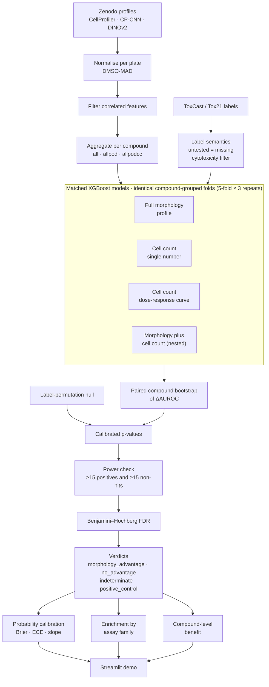

# Beyond the Count: A Reusable Statistical Audit for Cell-Count Shortcuts in Cell Painting Toxicology

**Code:** https://github.com/dhairya-pandya/beyond-the-count · **Live demo:** https://beyond-the-count1.streamlit.app/ · **Technical report:** `report/technical_report.pdf` · **Video:** <<VIDEO URL>>

## 1. Title, team, and summary

**Project:** Beyond the Count, a reusable statistical audit (CPSA, the Cell Painting Shortcut Audit) for cell-count shortcuts in Cell Painting toxicology.

**Track:** AI for Life Science Challenge, 5th Pazhou Algorithm Competition, Model & Algorithm category.

| Member | Role |
|---|---|
| Vrushti | Biology and data lead: label construction and provenance, dataset QA and sanity checks, biological interpretation of results |
| Dhairya | ML and statistics lead: model architecture, calibration and multiple-testing framework, Streamlit demo, reproducible pipeline |

**Summary.** Cell Painting is a high-content microscopy assay that stains cells with six dyes across five channels and extracts thousands of morphological features per cell. It is being adopted across pharma and regulatory toxicology as a scalable, animal-free readout of compound safety. One risk is that many toxicity labels are entangled with cytotoxicity, so a model that only knows how many cells survived a treatment can score well on those labels without reading any real morphology.

We built CPSA, a dataset-agnostic audit that tests, endpoint by endpoint, whether a full morphology profile predicts a toxicity label beyond what a cell-count baseline already predicts, with calibrated statistics, multiple-testing correction, and explicit handling of underpowered endpoints.

Applied to the public OASIS primary human hepatocyte dataset (Ewald et al., *Cell Systems*, 2026), the audit certifies **15 of 181 testable endpoints** for a genuine morphology advantage, including the metabolic-activity readout (MT) across three independent image representations. A nested test (morphology plus cell count against cell count alone) certifies 23 endpoints, including all 15. An exploratory second morphology source (EU-OPENSCREEN HepG2) agrees on MT and shows how strongly verdict counts depend on baseline strength.

A built-in organ-on-chip planner shows what the same audit would conclude at chip scale. We therefore see CPSA as a reusable quality-control layer for phenotypic toxicology pipelines in general, 2D plate or organ-on-chip, to run before anyone trusts an AI readout from one.

## 2. Problem definition and application scenario

Early toxicity screening needs to tell, for a given compound and a given biological endpoint, whether that compound is active, ideally before it reaches animal or human studies. Cell Painting is attractive here because one imaging assay yields a rich, unbiased morphological fingerprint instead of a single pre-chosen readout.

But toxicity labels are frequently derived from, or correlated with, cytotoxicity: a compound that kills or visibly stresses cells changes almost every measurable feature at once, including the crudest one, how many cells are left on the plate. This creates a specific and underappreciated failure mode. A model can appear to "read morphology" and predict toxicity endpoints well while doing nothing more sophisticated than counting surviving cells.

Seal, Dee, Shah et al. (*Nature Communications*, 2026; preprint on bioRxiv, doi 10.1101/2025.04.27.650853) demonstrated the same pattern on independent benchmarks. In the Hofmarcher dataset, a cell-count-only baseline (mean AUC 0.68 ± 0.21) matched a fully connected network on full Cell Painting profiles (mean AUC 0.67 ± 0.19). In the Moshkov dataset, 31 of 49 (63%) endpoints well predicted by gene expression were predicted equally well by cell count alone. (We checked these figures against the preprint text; the published version may differ slightly.)

Phenotypic profiling assays are being positioned as a scalable, more human-relevant alternative to animal testing, and regulators are starting to ask for it. FDA's March 2026 draft guidance on New Approach Methodologies in drug development names four factors for validating a method: context of use, human biological relevance, **technical characterization**, and **fit for purpose**. A phenotypic AI model that is secretly a cell counter has not been technically characterized, even if its benchmark numbers look strong.

The immediate target of this audit is 2D plate assays like the OASIS hepatocyte dataset used here, but the same failure mode will recur, and matter more, as organ-on-chip (OoC) systems scale up. OoC platforms are being developed as animal-free, human-relevant toxicology tools, and as they adopt AI-based image readouts they inherit the identical risk: a morphology model could pass internal validation by reading cell density or viability rather than the tissue-level biology the chip was built to capture.

We designed the audit to be dataset-agnostic for this reason, so a chip-based pipeline can run the same check on its own data before an AI readout informs a go/no-go decision. The organ-on-chip planner (Section 6) makes this concrete: it simulates the audit at chip-realistic compound counts (20 to 200) to show how large a chip study must be before the check has power to catch a shortcut.

## 3. Data sources, licenses, processing methods, and compliance

### Primary dataset

Ewald et al. (OASIS Consortium), *Cell Systems*, 2026: Cell Painting profiles of 1,085 compounds in primary human hepatocytes, imaged at a single 44-hour time point. Profiles are published on Zenodo (10.5281/zenodo.17067683, CC-BY 4.0) in three independent image representations: CellProfiler hand-engineered features, a Cell-Painting-specific CNN (CP-CNN), and DINOv2 self-supervised embeddings. 967 compounds carry a real `Metadata_OASIS_ID`; the rest are blinded by the authors and usable only for native readouts that do not require compound identity.

### Labels

ToxCast/Tox21 bioactivity hit-calls, released by the dataset's authors in their analysis repository (BSD-3-Clause) and built from invitrodb v4.1. The release provides both a raw, unfiltered hit-call and a filtered binary label. **Only the filtered binary files are valid as ground truth.**

- A hit is defined as hitcall > 0.9, then set to 0 if the endpoint's AC50 exceeds half the matched consensus cytotoxicity AC50 for that cell type (tissue as fallback).
- A consensus exists only if at least 20% of matched viability tests fired and the median AC50 is at most 100 µM.
- Duplicate records are collapsed by majority vote, with ties counted as no hit.
- Endpoints are retained only with at least 5 positive and 5 negative compounds, giving 38 cytotoxicity, 292 cell-based and 72 cell-free ToxCast/Tox21 endpoints (402), plus the study's own LDH, MT and cell-count readouts from `metadata.parquet` (405 endpoints in total).
- Native LDH, MT and cell-count labels have no missing values across all 21,456 wells. ToxCast/Tox21 labels cover 670 of the 1,085 compounds (61.8%) for cytotoxicity and cell-based endpoints. For cell-free endpoints the label files give 251 compounds, while an independent count gives 242; the difference is unresolved.

### A correctness-critical rule: missing is not negative

An untested compound-endpoint pair is **missing**, never a negative hit-call. This is confirmed on the released binary label matrix: 963 compounds × 292 cell-based endpoints = 281,196 possible cells, of which only 107,103 are observed (about 62% missing). Zero-filling missing pairs would silently inflate every endpoint's "inactive" count and invalidate the per-endpoint AUROC, power check and FDR correction downstream. `cpsa.data.load_labels` and `cpsa.data.preprocess` therefore exclude an absent pair from that endpoint's compound set throughout.

### A standalone sanity check before the pipeline

Before committing to the pipeline, the biology side ran a standalone cell-count-only check on 670 compounds that have both a usable cell-count feature and a ToxCast label. A cell-count-only classifier reached a median cross-validated AUC of 0.55 across 320 testable endpoints (mean 0.53, 25th/75th percentile 0.45/0.62), with only 7 of 320 (2.2%) endpoints at AUC 0.75 or higher. This was a go/no-go check on the data, not the final result. It showed that cell count alone does not trivially explain most labels, which justified building the full calibrated audit.

### A second, independent morphology source

EU-OPENSCREEN Bioactive Compound Set HepG2 Cell Painting profiles (Zenodo 10.5281/zenodo.19347244, CC-BY 4.0; four imaging sites, 10 µM, four replicates) were used as an exploratory second source. 327 of its compounds are also among the profiled OASIS compounds (matched by the skeleton block of the InChIKey), so the existing labels transfer. Example images of HepG2, U2OS and primary hepatocytes in the demo come from the public Cell Painting Gallery (CC0).

### Licensing and compliance

All data and code are public and explicitly licensed for reuse: the Zenodo profiles and OASIS metadata are CC-BY 4.0 (attribution required, redistribution permitted); the label-construction repository is BSD-3-Clause. No proprietary, restricted or personally identifying data is used. Compound identities are public ToxCast/Tox21 chemical identifiers or intentionally blinded by the original authors, and we did not attempt to de-anonymize the blinded compounds, since this serves no analytical purpose and the native-readout audit uses every compound without it.

## 4. Methods, models, algorithms, and system architecture

### Core design: matched models, not one

For every assay endpoint, CPSA trains models on **identical compound-grouped folds** (5-fold × 3 repeats, grouped by `Metadata_OASIS_ID` so no compound leaks across train and test):

1. **Full morphology:** the complete per-compound feature profile (CellProfiler, CP-CNN or DINOv2, aggregated under one of three rules: `all`, `allpod`, `allpodcc`).
2. **Cell count, single number:** one scalar cell-count summary per compound, the simplest possible shortcut baseline.
3. **Cell count, dose-response curve:** the concentration-resolved cell-count curve (cell count at each of eight concentrations, minimum, area under the curve, cell-count point of departure), a deliberately strong baseline so that any advantage reflects information beyond cell count.
4. **Morphology plus cell count (nested):** a model that sees both feature sets, compared against the cell-count curve alone. This answers the sharper question of whether morphology adds information on top of count.

All models use XGBoost with the paper's fixed hyperparameters (150 trees, learning rate 0.05), so capacity is constant across comparisons and no tuning touches a test fold. A separate regularised logistic regression on the morphology features (regularisation chosen inside each training fold) serves as a sanity comparator for the tree model.

### Statistical pipeline, applied to every endpoint

1. **Paired compound bootstrap** of the AUROC difference (ΔAUROC) between the full-morphology model and the cell-count-curve baseline.
2. **Label-permutation null** at the audit's own settings, used to calibrate the bootstrap p-values empirically. The raw bootstrap is too optimistic (it rejects about 10% of permuted CellProfiler endpoints at a nominal 5%); after calibration the rate is 2.6% on held-out permutation runs.
3. **Power check:** an endpoint receives a verdict only with at least 15 positive and 15 non-hit compounds; otherwise it is `indeterminate`.
4. **Benjamini-Hochberg FDR** across all powered endpoints, valid under the positive dependence that endpoints sharing compounds and assays display.
5. **Verdict assignment**, one of four per endpoint: `morphology_advantage` (certified after correction), `no_advantage` (shown as *no detectable advantage*: enough data, no detectable edge, which is absence of evidence and not proof of equivalence), `indeterminate` (underpowered), `positive_control` (the cell-count endpoint itself, solved by construction).
6. **Minimum detectable effect** for every endpoint: the smallest AUROC advantage its data could detect with 80% power, so a "no detectable advantage" verdict is read together with how large an advantage it could have seen.
7. **Probability calibration** of the full model's predictions (Brier score, expected calibration error, calibration slope).
8. **Enrichment analysis** by target family, assay design and cell type, with a Fisher exact test plus a permutation test over whole assays, so correlated endpoints from one assay are not double-counted.
9. **Compound-level benefit decomposition:** a ranking-benefit score per compound showing which compounds gain most from morphology over cell count.
10. **Organ-on-chip simulation:** the same audit re-run on simulated data at 20 to 200 compounds to characterise the detectable effect as a function of study size, feeding the demo's chip-study planner (Section 6).

### Pipeline stages and where they live

| Stage | Module |
|---|---|
| Normalization (per-plate DMSO-MAD), feature filtering, per-compound aggregation | `cpsa.data.preprocess` |
| Label loading and semantics (missing is not negative, cytotoxicity filter) | `cpsa.data.load_labels`, `cpsa.data.label_context` |
| Matched models, grouped cross-validation, bootstrap of ΔAUROC | `cpsa.models` |
| Nested model and logistic comparator | `cpsa.nested`, `cpsa.models.train_eval` |
| Permutation null and calibrated p-values | `cpsa.audit`, `cpsa.stats.null_calibration` |
| Power check, BH-FDR, verdict assignment | `cpsa.stats.multiple_testing` |
| Minimum detectable effect | `cpsa.stats.precision` |
| Probability calibration | `cpsa.stats.calibration` |
| Enrichment by target family, assay design, cell type | `cpsa.biology.enrichment` |
| Compound-level benefit and compound classes | `cpsa.biology.compound_classes` |
| Simulation with known ground truth, organ-on-chip planning | `cpsa.simulate`, `cpsa.chip` |
| Second morphology source (EU-OPENSCREEN HepG2) | `cpsa.data.eu_os` |
| Public API | `cpsa.api` (`shortcut_audit`, `permutation_null`) |

### System architecture



*Each endpoint runs through the matched models on identical folds; one statistics pipeline then sorts the result into one of four verdicts.*

## 5. Implementation details and technical components

**Repository layout:** `src/cpsa/` (the installable package), `scripts/` (numbered, ordered pipeline stages), `tests/` (69 unit tests), `demo/` (the Streamlit app), `docs/` (problem statement and planning documents), `report/` (this report and supporting write-ups), `results/` (generated outputs, included pre-computed so the demo runs without a rebuild).

**Rebuilding from raw data:** run the numbered scripts in `scripts/` in order, from `01_download_zenodo_data.py` through `15_calibrate_verdicts.py`, or run `scripts/20_full_audit.sh` for the complete three-representation audit in one call.

### Technical stack

| Component | Choice | Why |
|---|---|---|
| Classifier | XGBoost (gradient-boosted trees) | Held constant across all models so the comparison isolates feature content, not model capacity |
| Linear comparator | Regularised logistic regression | Confirms the signal is not specific to one model family |
| Cross-validation | Compound-grouped K-fold (5-fold × 3 repeats) | Prevents replicate and concentration rows of one compound leaking across train and test |
| Significance testing | Paired bootstrap of ΔAUROC + empirical permutation null | Calibrates p-values against the audit's own null, not an assumed distribution |
| Multiple-testing correction | Benjamini-Hochberg FDR | Valid under positive dependence across endpoints sharing compounds and assays |
| Calibration diagnostics | Brier score, expected calibration error (ECE), calibration slope | Checks predicted probabilities are trustworthy, not just well ranked |
| Demo / interface | Streamlit, kept awake by a scheduled GitHub Actions visit | Shareable, interactive exploration of results, calibration, enrichment, cell lines and the organ-on-chip planner |
| Reproducibility | Fixed random seeds, MD5-verified downloads | Every number here is reproducible from the raw public data |

### Design choices worth calling out

- **A strong, not weak, baseline.** The cell-count comparator sees the whole concentration-resolved dose-response curve, not a single median count. A weak baseline would make "morphology beats cell count" a foregone conclusion. The HepG2 second source shows the effect directly (Section 6).
- **Three image representations, not one.** Running the identical audit on CellProfiler features, a Cell Painting CNN and DINOv2 embeddings asks which certified endpoints are representation-independent: 8 endpoints are certified under all three, a more defensible claim than a result from a single feature extractor.
- **Everything runs on a laptop CPU.** There is no GPU or cloud dependency, which matters for a tool meant to be re-run by other toxicology teams on their own infrastructure.

## 6. Experiments, results, and evaluation

### Headline result

Of 405 endpoints, 181 had enough data (at least 15 positives and 15 non-hits) to receive a verdict. Of those 181, **15 are certified `morphology_advantage`** after calibration and FDR correction with CellProfiler features (CP-CNN also 15, DINOv2 54). The metabolic-activity readout (MT) is certified with all three representations (q = 0.019 / 0.039 / 0.001), while LDH is never certified at 5% against the strong baseline. 8 endpoints are certified under all three representations simultaneously. A plain bootstrap would have called 64 endpoints; calibration against the permutation null brings this to 15, and the certified count is better read as a band (5 to 67 for CellProfiler, depending on the assumed null width) than as a point.

| Check | Result |
|---|---|
| Endpoints certified `morphology_advantage` (main audit, CellProfiler) | 15 of 181 powered endpoints (CP-CNN 15, DINOv2 54) |
| Endpoints certified under all 3 image representations | 8 |
| Nested test: morphology plus cell count against cell count alone | 23 endpoints certified, including all 15 from the main audit; MT yes (q = 0.015), LDH no (q = 0.19) |
| Linear comparator | Regularised logistic regression reaches a median AUROC of 0.62, against 0.65 for XGBoost, so the signal holds for a linear model |
| Calibration accuracy (false-positive rate at a nominal 5%, held-out permutation runs) | 2.6% (CellProfiler); 6.5% (CP-CNN) and 6.2% (nested test) are slightly above nominal |
| Detectable effect | Median smallest detectable AUROC advantage over the 181 powered endpoints is 0.25; 18 endpoints could detect 0.10 |
| Compound-level benefit | Morphology helps most for compounds that change cells without removing them (+0.15 ranking benefit), a signature a cell count would miss by construction |
| Enrichment | Cytotoxicity endpoints look enriched among certified endpoints (Fisher p = 0.001) but not at the assay level (p = 0.12); reported as descriptive because those endpoints also have about four times more actives |
| Second morphology source (exploratory) | EU-OPENSCREEN HepG2, 327 shared compounds, 49 endpoints: MT certified in both systems, LDH in neither; HepG2 profiles certify 16 endpoints and primary-hepatocyte profiles 1 on the same compounds |

### Robustness checks, all consistent with the main result

- Alternative feature-aggregation rules: `all` 18, `allpod` 15, `allpodcc` 3 certified (a stated limitation).
- Chemical-similarity-grouped folds, so near-duplicate compounds cannot inflate performance: the median AUROC is unchanged (0.650 against 0.651) and all 15 certified endpoints stay certified.
- A plate, well and batch probe designed to surface hidden technical confounds: layout and batch information alone predict labels at chance (AUROC 0.51).
- A simulation with known ground truth, used independently to validate the audit and the organ-on-chip planner.

### The early sanity check and the final audit answer different questions

The early check asked whether cell count alone can explain most labels across all compounds and endpoints, with no calibration or correction. It found a weak, mostly-chance signal (median AUC 0.55), a useful go/no-go on the data. The final audit asks the sharper question of where the full profile beats a strong cell-count baseline once multiple testing and power are controlled, and answers it endpoint by endpoint. The two are complementary: the first shows that cell count is not trivially sufficient, the second shows where morphology adds value beyond it.

### Second morphology source: EU-OPENSCREEN HepG2 (exploratory)

On the 327 shared compounds and 49 endpoints with enough data, the audit was run twice with identical settings and its own permutation null each time: once with HepG2 profiles (four imaging sites, 10 µM) and once with the primary-hepatocyte profiles, against the same labels and the same single-number cell-count baseline. HepG2 has one concentration, so the dose-response baseline cannot be built.

| | HepG2 profiles | Primary hepatocytes |
|---|---|---|
| Endpoints certified (plain bootstrap would give) | 16 (22) | 1 (7) |
| Median AUROC, full profile | 0.71 | 0.68 |
| Median AUROC, cell-count baseline | 0.57 | 0.61 |
| MT (full profile / baseline) | 0.79 / 0.58, certified | 0.92 / 0.81, certified |
| LDH | not certified (q = 0.09) | not certified |

Ten of the 16 HepG2 endpoints are also certified in the main audit, including MT, the PR-bla antagonist and PXR agonist assays, and the liver, kidney and intestinal cytotoxicity summaries. The 16-against-1 gap should not be read as HepG2 revealing more morphology. The HepG2 cell count is one 10 µM measurement from another cell system and is a much weaker baseline for labels defined in primary hepatocytes (for MT, 0.58 against 0.81), and 327 compounds give far less power than the 967 of the main audit. It is the weak-baseline effect again: **a verdict count depends on baseline strength and sample size.** We therefore report this as an exploratory second source that supports the MT result, not as a replication of the 15 certified endpoints.

### Organ-on-chip scale (simulation)

Re-running the audit on simulated data with known ground truth at 20 to 200 compounds (720 endpoints per size, its own permutation null at each size) gives:

| Compounds | Cannot be judged (15/15 rule) | False credit, raw / calibrated p | Power to credit a true advantage | Smallest detectable advantage (AUROC) |
|---|---|---|---|---|
| 20 | 100% | 0% / 0% | 1% | 0.72 |
| 40 | 54% | 2% / 0.5% | 11% | 0.50 |
| 60 | 29% | 4% / 0.5% | 6% | 0.37 |
| 100 | 1% | 8% / 1.5% | 33% | 0.27 |
| 200 | 0% | 8% / 2% | 83% | 0.19 |

Calibration keeps false credit near zero at every size, but power is low at chip-typical sizes, so chip results should be reported as an AUROC difference with its calibrated interval rather than as a table of verdicts. Where compounds are replicated over chips, folds must be grouped by compound: with 40 compounds on three chips and random labels, cross-validation that treats each chip as independent reaches an AUROC of 0.85 (true value 0.5), against 0.51 when grouped. The demo's **Organ-on-chip** tab turns this into a study planner and a checklist for what a chip needs to change: labels (albumin, urea, CYP3A4, clinical DILI categories), a 3D cell-count proxy, features, grouping (compound, chip, donor) and sample size. No chip data is used or claimed.

### Interactive demo

[beyond-the-count1.streamlit.app](https://beyond-the-count1.streamlit.app/): a plate-map view of all 405 endpoints (click a dot to open it); per-endpoint verdicts with the nested comparison, logistic comparator and detectable effect; calibration reliability diagrams; recalibrated compound-level predictions; enrichment by target family, assay and cell type with assay-level p-values; a **Cell lines** tab with example images of primary hepatocytes, HepG2 and U2OS and an explorer of the cell systems behind the endpoints; and the organ-on-chip planner.

## 7. Reliability analysis and limitations

### Statistical reliability, by design

- **FDR correction is conservative by construction.** A true but borderline effect may be labelled `no_advantage` because of the correction. This is a deliberate trade-off, and it means the certified count is a band limited by power (5 to 67 for CellProfiler across plausible null widths), not an estimate of how many endpoints benefit.
- **The power check is conservative too.** Endpoints below 15 positives or 15 non-hits are explicitly `indeterminate` rather than absorbed into "no advantage", so the 181-of-405 powered fraction must be read alongside the 15-of-181 certified fraction.
- **Per-endpoint power is low.** The median minimum detectable effect is 0.25 AUROC, so only large advantages are individually certifiable; "no detectable advantage" says little about small effects.
- **The empirical null is an estimate.** It rests on 379 powered runs for CellProfiler, 274 for CP-CNN and only 58 for DINOv2, so the DINOv2 calibration is the weakest.
- **Dependence.** BH is valid under positive dependence, which fits endpoints sharing compounds and assays, but the assumption is not verified here. Enrichment p-values have an assay-level counterpart for the same reason.

### Data and label limitations

- **One hepatocyte pool and one time point.** Donor-to-donor variability is not modelled, and kinetic or delayed toxicity outside the single 44-hour time point is not captured. Results describe this pool and time point only.
- **2D plate assay, not an organ-on-chip system.** Every measured number comes from a 2D hepatocyte monolayer. The organ-on-chip results are simulations of what the method needs at chip scale, not chip measurements, and we make no claim that the certified endpoints transfer to a 3D or perfused system.
- **"Morphology" is not orthogonal to cell density.** Neighbour counts, granularity and embedding features can encode confluence and clumping, so a morphology advantage means information beyond the cell-count curve, which may include other density-related image properties.
- **Labels are partly cytotoxicity-entangled by design.** The cytotoxicity-AC50 filter applies only where a consensus cytotoxicity AC50 exists, about 35% of raw cell-based records, so a share of labels are not cytotoxicity-adjusted at all. A 0 can mean "no hit", "a hit overridden by the filter" or "a tie between duplicate records", never a confirmed negative. This is a property of the released ground truth, but it bounds how strong a claim "beyond cell count" can be for any method run on it.
- **Endpoint and compound coverage.** 38 of 48 source cytotoxicity categories survive the minimum-class-support filter. ToxCast/Tox21 labels cover 670 of 1,085 compounds (61.8%), versus the 89% sometimes quoted for this dataset, which is a union of chemical identifiers rather than an intersection with compounds actually tested here. We report the intersection throughout as the honest denominator.
- **One known deviation from the published methodology.** The released label files apply the 100 µM cytotoxicity-AC50 ceiling only to the consensus cytotoxicity AC50, not per endpoint as the published Methods describe. We used the released labels as-is, since re-deriving ground truth was out of scope for an audit tool that consumes whatever labels a dataset provides. Applying the ceiling exactly as described would change the cell-based positive count from 8,400 to an estimated 8,332 and drop one endpoint, a small and bounded effect on the input.
- **Aggregation dependence.** The certified count depends on the aggregation rule (18 / 15 / 3), and `allpod` is the paper's default and our pre-specified primary.

### Dependence on baseline strength and sample size

The EU-OPENSCREEN check agrees on MT but certifies a very different number of endpoints, because its cell-count baseline is weaker and its sample is smaller (Section 6). This is a finding about the method: a dataset with fewer compounds or a cruder cell-count readout will certify a different number of endpoints even with the same underlying biology, which is useful to know before applying the audit to a new dataset.

### What generalises

What we claim generalises is the method: matched models, a strong baseline, calibrated statistics, power-aware verdicts and FDR correction. The specific 15 certified endpoints are hepatocyte- and dataset-specific, and we expect them to differ for another cell type, tissue or assay panel.

## 8. Potential scientific and practical impact

Toxicity testing has a structural trust problem as it moves away from animals: a non-animal readout is only useful if the field can tell whether it measures the biology it claims to. Phenotypic imaging assays make that hard to verify because thousands of correlated features can hide a single trivial driver. Cell count is the most dangerous such driver precisely because it is biologically real (dying or stressed cells do leave the plate), yet it is not the mechanistic information a toxicologist needs when deciding whether a compound causes a specific hepatotoxic mode of action or simply kills cells outright. Without a way to separate the two, a lab can spend months validating a phenotypic AI model that turns out to be an expensive cell counter. Seal et al. (2026) showed the same pattern in independent Cell Painting benchmarks, and our own early sanity check (Section 3) was run specifically to rule it out before trusting our results.

We did not build a better toxicity classifier. Better classifiers already exist, and a marginally higher AUROC does not resolve the trust problem. We built a deliberately narrow audit: given any dataset with morphology profiles, cell counts and toxicity labels, tell a team which endpoints its morphology model can be trusted on, which it cannot, and which it is too early to judge. That framing makes the tool reusable rather than a one-off analysis: the same `cpsa.api.shortcut_audit` call runs on the OASIS hepatocyte data, the EU-OPENSCREEN HepG2 data, or a dataset a lab generates tomorrow.

In immediate practical terms this is a pre-flight check, like a positive and negative control before trusting an assay plate. Three concrete uses:

1. **A go/no-go check** before presenting an AI-toxicity model's accuracy, so "the model predicts hepatotoxicity" is not quietly "the model counts cells".
2. **A prioritisation tool:** the per-endpoint verdict table shows which endpoints justify the cost of full morphological profiling and which are adequately, and more cheaply, served by a cell-count readout alone.
3. **A study-design tool:** the organ-on-chip planner, used before a chip study is run, sizes the compound set so the check has power.

Organ-on-chip systems are being built and funded as more human-relevant, animal-free alternatives to both animal testing and 2D plates. As they adopt AI-based imaging readouts they will inherit the same cell-count risk, possibly in a worse form, since a chip's own structural and flow artefacts can act as additional density-correlated confounds. Building the audit to be dataset-agnostic, and shipping the planner alongside the 2D result, is a deliberate bet that the real value of this work is as infrastructure other groups' chip studies can adopt.

FDA's 2026 draft guidance on New Approach Methodologies asks for technical characterization and fit-for-purpose validation before a non-animal method informs a regulatory decision. A repeatable, dataset-agnostic shortcut audit is a concrete instance of technical characterization, the kind of artifact a validation package for an AI-based NAM would include.

## 9. Cross-disciplinary collaboration: biology × machine learning

This project was built by two people from different backgrounds, split along the line the problem itself demanded. Vrushti led the biology and data track (label provenance, the cytotoxicity-filter semantics, dataset QA), and Dhairya led the ML and statistics track (model architecture, calibration, the multiple-testing framework and the demo). Neither half could have substituted for the other, and the project's central technical risk (Section 2) lives at the seam between them.

The most consequential fact in the project, that `*_info.hitcall` is a raw, unfiltered value and only the `*_binary` files carry the filtered ground-truth label, is a biology-provenance fact with no ML content. Had it gone unnoticed, every downstream model, calibration and verdict would have been computed against the wrong labels without any statistical test catching it. It surfaced from the biology side reading the dataset authors' own label-construction notebook line by line, not from a modelling review. Conversely, the decision to compare morphology against the full cell-count dose-response curve rather than a single number, the choice that keeps the audit honest, is a statistical-design decision with no biology content, made on the ML side because a weak baseline would have made the headline claim meaningless however correct the labels were.

The two tracks ran in parallel with a standing rule: any finding that changed what a label meant, what a compound's identity implied or what "enough data" meant biologically was raised to the other track the same day it was found. The raw-versus-filtered correction was flagged and fixed before any model was trained on the wrong ground truth. The biology side also ran an early, deliberately simple sanity check (the cell-count-only probe of Section 3) before the full pipeline existed, to give the ML side a go/no-go signal early enough to change course.

The pairing fits the problem: a toxicologist alone could identify the cell-count confound but not build a calibrated, FDR-corrected test for it at scale. A machine learning engineer alone could build that machinery but would not know that a 0 in a label column sometimes means "tied duplicate record" rather than "confirmed non-toxic", or that the cytotoxicity filter covers only about 35% of raw records. A trustworthy audit, not just a working script, depends on both kinds of correctness holding at once.

## 10. Reproduction instructions

```bash
python3.12 -m venv .venv && .venv/bin/pip install -r requirements.txt && .venv/bin/pip install -e .
.venv/bin/streamlit run demo/app.py        # precomputed results are included in results/
```

To rebuild every result from the raw public data rather than the included outputs, run the numbered scripts in `scripts/` in order (`01_download_zenodo_data.py` through `15_calibrate_verdicts.py`), or run `scripts/20_full_audit.sh` for the full three-representation audit in one call. Later scripts add the nested audit (`22`), detectable effect (`23`), chip-scale study (`24`) and the EU-OPENSCREEN second source (`25`). All downloads are MD5-verified and all stochastic steps use fixed seeds. No GPU is required.

**Data access (no account or payment required):**

- Profiles: Zenodo 10.5281/zenodo.17067683 (CC-BY 4.0).
- Labels and annotations: github.com/jessica-ewald/2024_09_09_Axiom_OASIS (BSD-3-Clause).
- Second source: Zenodo 10.5281/zenodo.19347244 (CC-BY 4.0), with annotations from the v1.0.0 record 10.5281/zenodo.13309566.

## 11. Sources and licenses of external models, libraries, datasets, and tools

| Item | License / terms | Role in this project |
|---|---|---|
| Ewald et al. (OASIS Consortium), *Cell Systems*, 2026: Cell Painting profiles, Zenodo 10.5281/zenodo.17067683 | CC-BY 4.0 | Primary dataset: morphology profiles (CellProfiler, CP-CNN, DINOv2) and native LDH/MT/cell-count readouts |
| jessica-ewald/2024_09_09_Axiom_OASIS analysis repository | BSD-3-Clause | ToxCast/Tox21 label construction, cytotoxicity-filter logic, endpoint annotations |
| EU-OPENSCREEN HepG2 Cell Painting profiles, Zenodo 10.5281/zenodo.19347244 and annotations 10.5281/zenodo.13309566 | CC-BY 4.0 | Exploratory second morphology source (Section 6) |
| Cell Painting Gallery (cpg0036-EU-OS-bioactives, cpg0037-oasis) | CC0 | Example images in the demo's cell-line gallery (fetched individually) |
| Seal, Dee, Shah, Cerisier, Zhang, Miglietta, Titterton, Cabrera, Boiko, Beatson, Slabaugh, Taboureau, Puigvert, Singh, Spjuth, Bender, Carpenter. "Counting cells can accurately predict small-molecule bioactivity benchmarks." *Nature Communications*, 2026 (preprint: bioRxiv 10.1101/2025.04.27.650853) | Journal publication, cited not redistributed | Motivates the cell-count shortcut risk (Sections 2, 8) |
| FDA. *General Considerations for the Use of New Approach Methodologies in Drug Development.* Guidance for Industry, Draft, March 2026 | US government publication (public domain) | Regulatory framing: context of use, human biological relevance, technical characterization, fit for purpose (Sections 2, 8) |
| XGBoost | Apache 2.0 | Classifier for all matched models |
| scikit-learn | BSD-3-Clause | Cross-validation, logistic-regression comparator, calibration metrics |
| NumPy, pandas, SciPy, statsmodels | BSD-3-Clause | Numerics, tables, statistics, multiple-testing correction |
| RDKit | BSD-3-Clause | Chemical-similarity clustering for grouped folds and compound matching |
| Streamlit, Plotly | Apache 2.0, MIT | Interactive demo and charts |
| Playwright | Apache 2.0 | Headless browser used by the keep-alive workflow |
| CellProfiler | BSD-3-Clause | One of three feature-extraction pipelines (features already computed and released by the dataset authors; not re-run here) |
| DINOv2 (Meta AI) | Apache 2.0 | Self-supervised embedding representation (embeddings already computed and released by the dataset authors; not re-run here) |

No proprietary datasets, paid APIs or non-redistributable third-party content are used anywhere in this project. Every input and dependency above is open-licensed, a public government publication, or a cited published finding used for motivation only.
