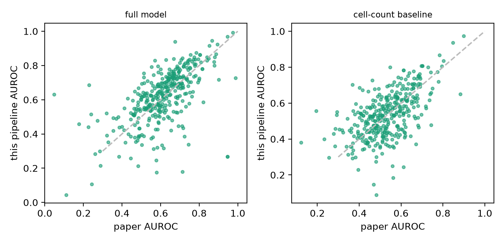
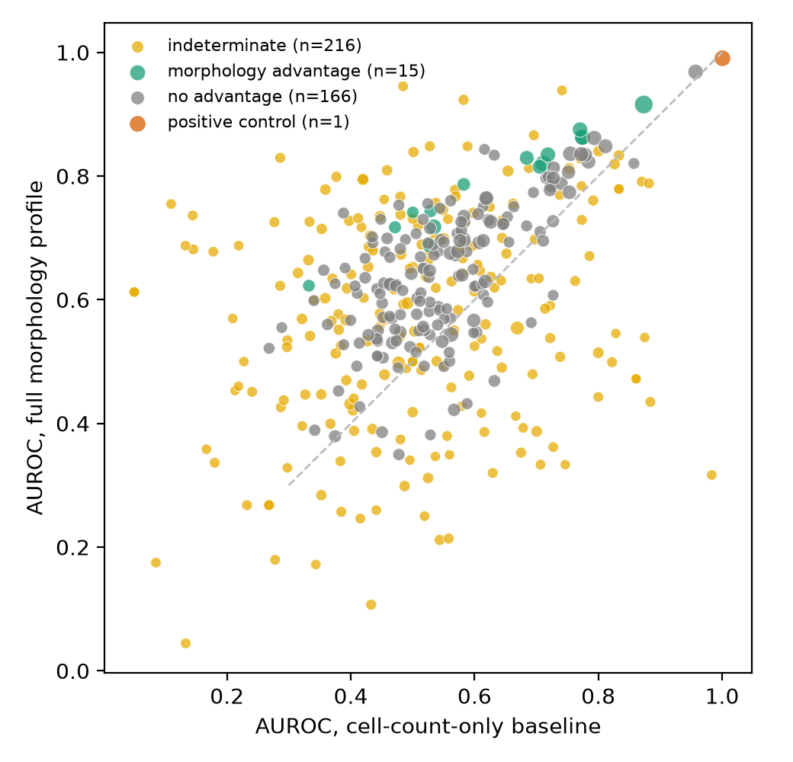
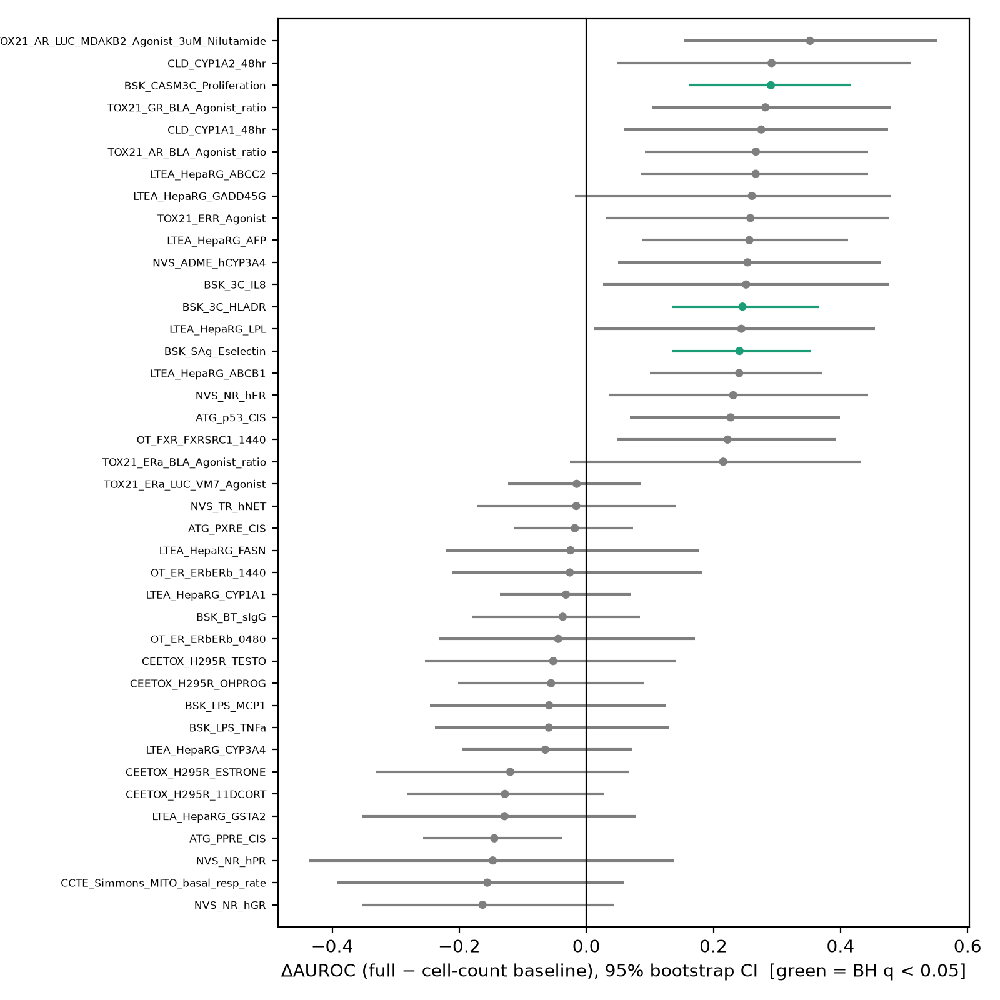
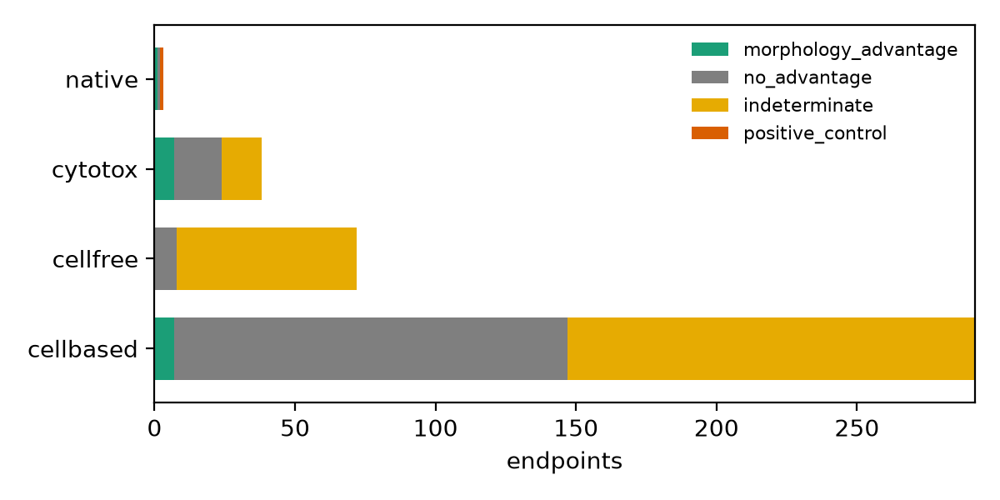
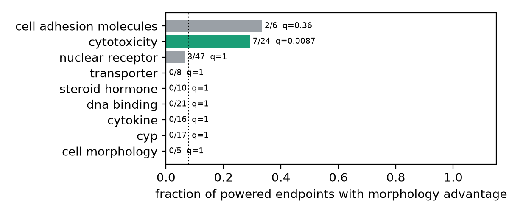
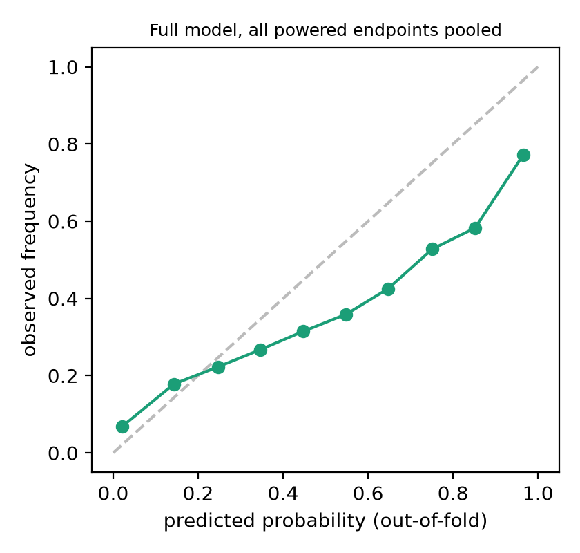

# Cell Painting Shortcut Audit: does morphology beat a cell-count baseline, once we correct for testing hundreds of endpoints?

**Competition:** AI for Life Science Challenge (5th Pazhou Algorithm Competition) · **Category:** Model & Algorithm
**Team:** <<TEAM COMPOSITION — declare members and disciplines (cross-disciplinary bonus)>>
**Code:** <<GITHUB URL>> · **Demo:** <<STREAMLIT URL>> · **Video:** <<VIDEO URL>>

> All numbers are regenerated from `results/` (see §7). Placeholders in `<<…>>` (team, URLs) are for the team to fill before submission.

---

## 1. Problem definition

Image-based phenotypic profiling (Cell Painting) is being adopted as a scalable, human-relevant new approach methodology (NAM) for toxicology. Models trained on such profiles can score well for the wrong reason: for cytotoxicity-related readouts, a model that only *counts surviving cells* can match a sophisticated morphology model, so an apparent "morphology signal" may be a cell-count shortcut. The source study (Ewald et al., 2026) compares morphology to a cell-count baseline, but, over ~400 external endpoints, does not (i) correct for the number of endpoints tested, (ii) separate endpoints with too few positives to support any conclusion, or (iii) test whether morphology's advantage clusters in a coherent biological family.

**Contribution.** A reusable, dataset-agnostic *audit* that answers, per endpoint: (1) does the full morphological profile beat a cell-count-only model after Benjamini–Hochberg FDR control across all tested endpoints? (2) is there enough data to say — otherwise the endpoint is reported as *indeterminate*; (3) where morphology wins, is the advantage concentrated in an assay/target family, or arbitrary?

**Scope and non-claims.** The data are a 2D primary-human-hepatocyte plate assay, not an organ-on-a-chip. We position the work as a validation-methodology contribution relevant to organ-on-chip toxicology, whose readouts face the same shortcut risk; we do not claim chip results. No raw-image modeling (precomputed profiles only), no new wet-lab data, a single 44 h time point, donor variability not modeled.

## 2. Data sources and licenses

| Item | Source | License |
|---|---|---|
| Well-level profiles (CellProfiler, CP-CNN, DINOv2), metadata, image index | Zenodo 10.5281/zenodo.17067683 | CC-BY 4.0 |
| ToxCast/Tox21 binary hit-calls, endpoint annotations (target family, assay design), SI tables (LDH/MT/cell-count hits and points of departure) | github.com/jessica-ewald/2024_09_09_Axiom_OASIS | BSD-3-Clause |
| Source paper | Ewald et al., *Cell Systems* 17(5):101566 (2026), doi:10.1016/j.cels.2026.101566 | — |

Design of the source experiment: 1,085 compounds (pharmaceuticals, pesticides, industrial chemicals), 8 concentrations × 2 replicates, primary human hepatocytes, 384-well, 44 h exposure; LDH, metabolic-activity (MT) and Cell Painting (6 dyes, 5 channels) readouts with cell count extracted from the images. We use only the published, precomputed profiles; raw images (Cell Painting Gallery, ~650 TB bucket) are not downloaded.

### 2.1 Dataset statistics
| quantity | value |
|---|---|
| wells / plates / DMSO control wells | 21,456 / 65 / 4,849 |
| compounds with an OASIS id (profiled, modeled) | 967 (966 for DINOv2) of 1,086 compound names; the rest are blinded |
| concentrations per compound | 8 (one compound 7), 2 replicates, spanning 13–16 plates from two production batches |
| raw → retained features after variance and correlation (|r| > 0.9) filters | CellProfiler 5,640 → 984 · CP-CNN 672 → 666 · DINOv2 4,608 → 4,424 |
| endpoints | 292 cell-based + 72 cell-free + 38 cytotoxicity (ToxCast/Tox21) + MT, LDH, cell_count (native) = 405 |
| profiled compounds with a label per endpoint, median (min–max) | cell-based 202 (10–652) · cell-free 20 (7–131) · cytotoxicity 229 (13–667) |
| actives per endpoint among profiled compounds, median (10th–90th percentile) | cell-based 15 (5–39) · cell-free 8 (4–23) · cytotoxicity 69 (5–132) |
| endpoints with ≥ 15 actives and ≥ 15 non-hits among modeled compounds | 181 of 404 (cell-based 147 / 292, cytotoxicity 24 / 38, cell-free 8 / 72, native 2) |

Label provenance: the Zenodo record contains profiles and metadata only; outcome labels were located in the authors' public analysis repository (`1_snakemake/inputs/annotations/*_binary.parquet`, `2_downstream_analysis/compiled_results/SI_tables/`). We therefore did not need to re-derive hit-calls from EPA invitrodb. The repository's cytotoxicity file contains 38 endpoint columns (the paper text refers to 48); we use what is shipped.

## 3. Methods

### 3.1 Profile preprocessing (re-implemented from the authors' pipeline)
Per plate, features are centred and scaled by the median and MAD of that plate's DMSO controls; features that are non-finite, or have zero MAD / |MAD/median| ≤ 10⁻³ in any plate, are dropped; a greedy correlation filter (|r| > 0.9) removes redundant features. Per-compound profiles are obtained by averaging treated wells under three aggregation rules taken from the source repository: `all` (all wells), `allpod` (wells above the compound's Cell Painting point of departure, POD), `allpodcc` (wells above the POD and below the cell-count POD, with the source's fallbacks). PODs are taken from the published SI tables.

### 3.2 Models
For every endpoint, three XGBoost classifiers (150 trees, learning rate 0.05, `scale_pos_weight` = neg/pos — identical to the source classifier) are trained on identical folds:

* **full** — the morphology profile (CellProfiler primary; CP-CNN and DINOv2 as robustness checks);
* **scalar_cc** — the source paper's baseline: the mean cell count (one number);
* **strong_cc** — a deliberately *stronger* shortcut model that still sees **only cell-count information**: the scalar count, cell count at each of the 8 concentrations (÷ plate DMSO median), their minimum and mean, and the cell-count POD.

The strong baseline is the primary comparator: a verdict against a one-number baseline can be an artefact of that baseline being weak. The technical-covariate baseline in the original plan (plate, well position, batch) is not applicable at compound level, because each compound's profile averages wells from 13–16 plates.

### 3.3 Cross-validation and effect estimate
Stratified, compound-grouped, shuffled 5-fold CV (folds reduced to min(5, n_pos, n_neg) for sparse endpoints), repeated 3× with different fold seeds; out-of-fold probabilities are averaged over repeats. ΔAUROC = AUROC(full) − AUROC(baseline) on pooled out-of-fold predictions. A paired bootstrap over compounds (1,000 resamples) gives a 95% interval and a standard error SE; the raw one-sided p-value is p = (1 + #{Δ* ≤ 0})/(B + 1). This captures *evaluation-sample* variability only — not the variability of the fitted models — which turns out to matter (§3.4).

### 3.4 Auditing the audit: label-permutation null and calibrated p-values
We re-ran the identical pipeline on hundreds of endpoints whose labels were randomly permuted across compounds (true Δ = 0 by construction; `scripts/08_null_control.py`). Under this null the z-score z = Δ/SE has a standard deviation clearly above 1, so raw bootstrap p-values are anti-conservative. Following Efron's empirical-null idea we estimate sd₀ from the powered permutation runs and use the calibrated one-sided p-value p_cal = P(Z > z/sd₀). The estimate is feature-set specific (§4.4); split-half validation (sd₀ from the first runs, error rates on held-out runs) checks that the calibration holds. Raw bootstrap p-values and verdicts are retained alongside (`bootstrap_p`, `verdict_uncalibrated`).

### 3.5 Power check, multiple-testing correction, verdicts
An endpoint is *powered* if it has ≥ 15 actives and ≥ 15 inactives among profiled compounds (pre-specified heuristic; sensitivity in §4.8 — it was not tuned after seeing results). Benjamini–Hochberg FDR is applied to the calibrated p-values across **powered** endpoints only. Verdicts: `morphology_advantage` (powered, Δ > 0, q < 0.05), `no_advantage` (powered, otherwise), `indeterminate` (under-powered; excluded from the FDR pool and from the enrichment test, never reported as a finding either way). The `cell_count` native endpoint, whose label is defined from the cell-count curve, is a positive control (the strong baseline must reach AUROC ≈ 1) and is outside the pool. BH assumes independence or positive dependence; endpoints share compounds and are correlated, which we flag as a limitation.

### 3.6 Calibration
On out-of-fold probabilities of the full model: Brier score, Brier skill versus the prevalence predictor, expected calibration error (10 bins), calibration slope of a logistic recalibration, and the Brier score after cross-validated Platt recalibration. Because training re-weights classes, raw probabilities are scores rather than frequencies; the demo shows this explicitly.

### 3.7 Biological enrichment
For each grouping (assay/target family, assay design type, cell line, tissue, category), a one-sided Fisher exact test asks whether the group is over-represented among `morphology_advantage` endpoints relative to the other powered endpoints (min group size 5; BH within each grouping). Target families come from EPA's own `intended_target_family` annotation, so no per-compound annotation is required. Null results are reported as such.

### 3.8 Implementation
The package `src/cpsa/` mirrors the pipeline: `data/` (`load_profiles`, `preprocess`, `load_labels`, `build_dataset`, `technical`), `models/` (`train_eval`: grouped CV, XGBoost wrapper, paired bootstrap; `baseline`, `full_model`: feature-set definitions), `stats/` (`power_check`, `multiple_testing`, `null_calibration`, `calibration`), `biology/` (`enrichment`, `feature_families`), `viz/plots`, and `audit.py` (end-to-end orchestration with joblib parallelism over endpoints). Numbered scripts in `scripts/` are thin command-line wrappers; every figure and number in this report is regenerated from `results/` by scripts 07, 12 and 13. Design choices that serve reproducibility: one parquet per (representation, aggregation) cached in `data/processed/`; fixed seeds everywhere; MD5-verified downloads; no hidden state in notebooks (notebooks are exploration only); 30 unit tests including a grouped-CV leakage test (duplicated compounds with noise features must score at chance), a toy BH reference, an empirical-null recovery test and a reproduction of the paper's unshuffled fold protocol. The demo reads only precomputed artifacts.

## 4. Results

Primary configuration (pre-specified in the project plan): **CellProfiler features, `allpod` aggregation**; numbers from `results/cellprofiler_allpod/` (`headline_numbers.json`, regenerated by `scripts/12_headline_numbers.py`). CP-CNN and DINOv2 are robustness checks. 404 endpoints were tested (292 cell-based, 72 cell-free, 38 cytotoxicity ToxCast/Tox21 endpoints plus the paper's MT and LDH hits); `cell_count` is the positive control. Figures are in `results/figures/`.

### 4.1 The pipeline reproduces the source paper's AUROC level
Against the paper's published per-endpoint AUROCs (CP-CNN features, `allpod`, 179 powered endpoints), re-running our models under the **paper's own protocol** (unshuffled `StratifiedKFold`, one run, the paper's row order; `scripts/11_paper_faithful_cv.py`) gives a mean AUROC difference of +0.004 (full model) and +0.007 (cell-count baseline), Pearson r = 0.79 / 0.70 across endpoints — limited by small-sample noise: for CellProfiler features and endpoints with ≥ 30 actives r = 0.91 / 0.85. Our default protocol (shuffled folds, 3 repeats averaged) scores the full model ≈ +0.04 higher, i.e. the offset is a cross-validation-protocol effect, not a data-processing one.

### 4.2 Most endpoints cannot support any claim, and naive wins are mostly not certifiable

| step (CellProfiler, `allpod`) | endpoints |
|---|---|
| tested (excl. positive control) | 404 |
| ΔAUROC > 0 against the strong cell-count baseline — the naive "morphology wins" | 291 |
| … of which powered (≥ 15 actives and ≥ 15 inactives); **223 (55 %) are indeterminate** | 158 |
| … and raw bootstrap p < 0.05, uncorrected | 88 |
| … and BH q < 0.05 on raw bootstrap p-values (anti-conservative, §4.4) | 62 |
| … and **BH q < 0.05 on null-calibrated p-values → `morphology_advantage`** | **9** (of 181 powered) |

For indeterminate endpoints the reported AUROCs are essentially noise: the full-model AUROC has a standard deviation of 0.175 across indeterminate endpoints versus 0.117 across powered ones, and 56 of 223 lie outside [0.4, 0.8] (40 below 0.4). Reporting them as clean AUROCs would manufacture spurious wins and losses (figure below: indeterminate endpoints in yellow scatter from 0.02 to 1.0).

 Yet effect sizes among the powered endpoints are broadly positive — ΔAUROC > 0 for 158 of 181 (87 %), median Δ = +0.095 (median AUROC 0.650 full vs 0.542 strong cell-count baseline) — so the limit is per-endpoint statistical certainty, not an absence of signal: with 15–60 actives per endpoint only large effects can be certified individually.

### 4.3 The certified endpoints form a stable core across representations
| representation (`allpod`) | null sd₀ | certified vs strong cc | certified vs scalar cc | raw-bootstrap counts (strong / scalar) |
|---|---|---|---|---|
| CellProfiler (primary) | 1.45 | **9** | 27 | 62 / 75 |
| CP-CNN | 1.23 | 33 | 56 | 63 / 84 |
| DINOv2 (null sd borrowed from CellProfiler; conservative) | 1.45* | 40 | 39 | 82 / 78 |

All 9 CellProfiler-certified endpoints are also certified with CP-CNN and with DINOv2 (a core set: PR-bla antagonist, GR-bla antagonist, PXR agonist, a BioMAP proliferation assay and five cytotoxicity-burst endpoints); 27 endpoints are certified under at least two representations, 46 under any. ΔAUROC is rank-correlated across representations over the 181 powered endpoints (Spearman 0.68 CellProfiler vs CP-CNN, 0.62 vs DINOv2). The *number* certified depends strongly on the representation (9 / 33 / 40), so we report all three rather than a single headline. *DINO's null was not run (4,424 features); borrowing CellProfiler's sd₀ is conservative.

Endpoints certified with CellProfiler features (all nine are also certified with CP-CNN and DINOv2):

| endpoint | category / family | actives / inactives | AUROC strong cc → full | Δ | q (CellProfiler) | q (CP-CNN) | q (DINOv2) |
|---|---|---|---|---|---|---|---|
| `TOX21_PR_BLA_Antagonist_ratio` | cellbased / nuclear receptor | 145 / 450 | 0.54 → 0.72 | +0.177 | 0.005 | 0.000 | 0.000 |
| `tissue__kidney` | cytotox / cytotoxicity | 130 / 536 | 0.78 → 0.88 | +0.099 | 0.005 | 0.015 | 0.004 |
| `cell_type__HEK293` | cytotox / cytotoxicity | 186 / 409 | 0.71 → 0.82 | +0.109 | 0.006 | 0.000 | 0.009 |
| `cell_type__ME-180` | cytotox / cytotoxicity | 101 / 494 | 0.69 → 0.83 | +0.138 | 0.007 | 0.000 | 0.001 |
| `TOX21_PXR_agonist` | cellbased / nuclear receptor | 124 / 471 | 0.53 → 0.69 | +0.154 | 0.025 | 0.018 | 0.012 |
| `tissue__intestinal` | cytotox / cytotoxicity | 100 / 552 | 0.70 → 0.82 | +0.118 | 0.025 | 0.014 | 0.013 |
| `BSK_SAg_Proliferation` | cellbased / cell cycle | 56 / 146 | 0.58 → 0.79 | +0.209 | 0.031 | 0.022 | 0.009 |
| `cell_type__ERR-HEK293T` | cytotox / cytotoxicity | 131 / 464 | 0.73 → 0.83 | +0.109 | 0.031 | 0.001 | 0.001 |
| `TOX21_GR_BLA_Antagonist_ratio` | cellbased / nuclear receptor | 53 / 599 | 0.52 → 0.74 | +0.227 | 0.043 | 0.001 | 0.002 |

### 4.4 Auditing the audit: raw bootstrap p-values are anti-conservative

In 424 powered label-permutation runs with CellProfiler features (full and strong baseline mean AUROC 0.502 and 0.497, as they should) the z-score has sd 1.45 (95% interval of the estimate 1.34–1.56), so the raw p-value rejects at nominal 0.05 in **13.2 %** of runs (4.7 % at nominal 0.01; KS test against uniform p = 0.0006). The inflation is feature-set specific (CP-CNN: sd 1.23, 190 runs, 6.3 % at 0.05). Calibrating with sd₀ estimated from the first 141 runs brings the error rate on the 283 held-out runs to 4.9 % (nominal 0.05) and 1.8 % (nominal 0.01), against 13.1 % raw. The permutation runs used 2 CV repeats and 500 bootstrap resamples (the audit itself uses 3 and 1,000), which makes sd₀ slightly conservative: a matched-settings re-check (91 powered runs, 3 repeats, 1,000 resamples, new seed) gives sd 1.33 (bootstrap interval 1.13–1.51), and calibrating those runs with the reported 1.45 yields 3.3 % (nominal 0.05) and 0 % (nominal 0.01) false positives. No permuted-label run produced a `morphology_advantage` verdict. Without this control the headline would have been 62 certified endpoints rather than 9; the calibrated count is the one we report.

### 4.5 Weak baselines hide shortcuts
Against the paper's scalar cell-count baseline 27 endpoints are certified; 20 of them lose the advantage against the stronger cell-count baseline (2 are certified only against the strong baseline, where the 10-feature model over-fits at small n). The strong baseline matters most for the native readouts:

| readout | scalar cc | strong cc | full (CellProfiler) | Δ vs strong | BH q (CP / CP-CNN / DINO) | verdict vs scalar |
|---|---|---|---|---|---|---|
| MT (metabolic activity) | 0.835 | 0.878 | 0.916 | +0.037 | 0.063 / 0.006 / 0.004 | advantage (q = 10⁻⁴) |
| LDH (membrane damage) | 0.936 | 0.958 | 0.969 | +0.011 | 0.30 / 0.23 / 0.14 | advantage (q = 0.03) |
| cell_count (positive control) | 0.975 | 1.000 | 0.991 | — | — | control passes |

Morphology beats cell count for MT in two of three representations (borderline for CellProfiler) but is **never** certified for LDH — in agreement with the paper — while the one-number baseline would have called LDH a win. The strong baseline reaching AUROC 1.000 on the cell-count positive control confirms that it captures everything cell count can give.

### 4.6 Where morphology wins
| category | powered | certified (CellProfiler / CP-CNN / DINO) |
|---|---|---|
| cell-based reporter endpoints | 147 / 292 | 4 / 22 / 23 |
| cytotoxicity-burst endpoints | 24 / 38 | 5 / 10 / 16 |
| cell-free (biochemical) endpoints | 8 / 72 | 0 / 0 / 0 |

89 % of cell-free endpoints cannot be adjudicated and none of the 8 that can shows an advantage — consistent with the paper's finding that Cell Painting does not predict purely biochemical activity.

**Enrichment.** One-sided Fisher tests (BH within each grouping) find **cytotoxicity-burst endpoints** over-represented among advantage endpoints with every representation: CellProfiler 5/24 (21 %) vs 2.5 % elsewhere (odds ratio 10, q = 0.007); CP-CNN 10/24 vs 15 % (q = 0.010); DINOv2 16/24 vs 15 % (q < 0.001). This is a coherent rather than arbitrary pattern: these are the endpoints where cell count is already informative (strong-baseline median AUROC 0.73) and morphology still adds information — consistent with morphology reading sub-lethal stress before cells are lost. No target family, cell type or tissue is otherwise enriched in any representation (nuclear receptors 3/47 with CellProfiler, 10/47 with CP-CNN and DINOv2, q = 1.0; liver-derived assays 1/64, 9/64 and 6/64, q = 1.0 — hepatocyte-lineage assays are *not* favoured; cervix-derived cell lines 1/5, 2/5, 1/5, q ≥ 0.79). An exploratory grouping by assay mode (agonist / antagonist; antagonist-mode assays are classically cytotoxicity-confounded) flagged agonist-mode endpoints with CP-CNN only (q = 0.02) and is not replicated, so we do not interpret it. Gain importance by compartment, feature type and channel is nearly identical for the 9 advantage and the 172 other powered endpoints (granularity 31 % of gain vs 25 % of features; image-level features 26 % vs 19 %), so no single channel or compartment explains where morphology wins (small group; interpret with care).

### 4.7 Not a technical shortcut
Plate number, mean well row/column and batch alone predict ToxCast labels at chance (mean AUROC 0.510; 11.6 % of endpoints above 0.6; `scripts/09_technical_probe.py`); adding them to the strong cell-count model changes nothing (0.564 vs 0.557), and for none of the 9 certified endpoints does "technical + cell count" match the full profile.

### 4.8 Robustness
* **Power threshold** (min actives/inactives per class 10 / 15 / 20 / 30): 8 / **9** / 16 / 24 certified endpoints out of 242 / 181 / 139 / 75 powered. A stricter threshold shrinks the BH pool and increases the count; 15/15 was fixed in advance and not tuned.
* **α = 0.10**: 30 certified (vs 9 at 0.05).
* **Chance-floored baseline** (Δ = full − max(baseline, 0.5), so a below-chance baseline — cross-validation noise — cannot inflate Δ): 9 of 9 retained.
* **Aggregation rule** (CellProfiler): `all` 18, `allpod` 9, `allpodcc` 0 certified vs the strong baseline (vs scalar: 42 / 27 / 48). `allpodcc` aggregates only wells below the cell-count POD, which by construction leaves little for any model to separate from the full count curve; the aggregation-dependence of the strong-baseline count is a limitation.
* **Representation**: §4.3.

### 4.9 Calibration
Raw probabilities are not trustworthy as confidences: for every one of the 181 powered endpoints the calibration slope is below 0.8 (median 0.33 — strongly over-confident, a consequence of class re-weighting), median expected calibration error 0.081, and only 32 % of powered endpoints beat the prevalence predictor in Brier score (median Brier skill −0.07). Cross-validated Platt recalibration lowers the median Brier score from 0.112 to 0.104. The demo therefore shows recalibrated probabilities together with each endpoint's calibration diagnostics.

## 5. Reliability analysis and limitations

What we did to make the audit itself trustworthy: label-permutation null with split-half validation (§4.4); a positive control that the strong baseline must solve (§4.5); a chance-floored baseline (§4.8); a technical-confound probe (§4.7); calibration diagnostics (§4.9); reproduction of the source paper's numbers under its own protocol (§4.1); a pre-specified power threshold with a sensitivity grid (§4.8); replication across three representations and three aggregation rules (§4.3, §4.8); 30 unit tests covering preprocessing, grouped CV, bootstrap, BH, calibration, enrichment and the null calibration (`python -m pytest`).

Limitations, stated plainly:

* **Per-endpoint power is low.** With 15–60 actives per endpoint only large effects are individually certifiable; 55 % of endpoints are indeterminate, and the certified count (9 / 33 / 40 by representation) is a lower bound on endpoints where morphology helps, not an estimate of it.
* **Empirical-null calibration is approximate.** sd₀ is estimated from permutation runs (CellProfiler 424, CP-CNN 190); its 95% interval for CellProfiler is 1.34–1.56, it varies mildly with endpoint size (1.2–1.65), and the main runs used fewer CV repeats than the audit (hence slightly conservative; matched-settings check in §4.4). DINOv2's null was not run (CellProfiler's sd₀ is borrowed). A per-endpoint permutation test would be cleaner but costs ~10⁵ model fits per configuration.
* **Dependence in BH.** Endpoints share compounds and are correlated; BH is valid under positive dependence but this is not verified here.
* **"Morphology" is not orthogonal to cell density.** CellProfiler (neighbour counts, granularity, image-level features) and especially embedding features can encode confluence and clumping; the strong baseline sees only cell-count summaries. A "morphology advantage" therefore means *information beyond the cell-count curve*, which may include other density-related image properties.
* **Aggregation dependence.** The strong-baseline count varies with the aggregation rule (`all` 18, `allpod` 9, `allpodcc` 0 for CellProfiler); `allpod` is the paper's default and our pre-specified primary.
* **Baseline strength has no ceiling.** A still stronger cell-count model (more features, tuning) might certify fewer endpoints; ours is a deliberate best-effort shortcut, not an upper bound.
* **What a 0 means.** In the ToxCast matrices a 0 is *not* "tested and negative": it is no hit, a hit overridden by the cytotoxicity filter, or a tie. The filter (hit set to 0 if the endpoint AC50 exceeds half the matched consensus cytotoxicity AC50) applies only where such a consensus exists (≥ 20 % of matched viability tests fired, ≤ 100 µM; about 35 % of cell-based records), so many cell-based labels are not cytotoxicity-adjusted. Untested pairs stay missing (61.9 % of the cell-based matrix; pinned by a regression test). We say "non-hit" for the 0-class; the `n_inactive` column keeps its name. A preliminary stratified check (`scripts/19_filter_stratified.py`) is described in `docs/PROBLEM_STATEMENT.md` §3.3b.
* **Irregular design.** Concentration series differ by source batch (952 compounds on 0.0456–100 µM, 14 on a 100× lower series, one with 7 points) and replicate counts vary (829 single-well compound-concentration cells); dose-response baseline features therefore include concentration-interpolated cell counts and the technical probe includes well counts.
* **Label quality.** ToxCast hit-calls come from heterogeneous assays and cell systems; the 38 cytotoxicity columns are cell-type/tissue summaries where 1 = *cytotoxic* (the paper's 48 is before a minimum-5-positive / 5-negative filter); actives are rare for many endpoints; structurally related compounds in different folds could inflate all models equally.
* **Scope.** Single donor/pool of primary hepatocytes (donor variability not modeled), one 44 h time point, 2D plate assay — not an organ-on-chip; compound-level modeling means plate/well covariates are probed separately rather than included.

## 6. Motivation and impact

*Regulatory context.* FDA's March 2026 draft guidance "General Considerations for the Use of New Approach Methodologies in Drug Development" (Federal Register 2026-05390, 19 March 2026) names four factors for validating a NAM — context of use, human biological relevance, **technical characterization** and **fit for purpose**. An audit that tells a developer whether a profiling model's predictive power is a real signal or a trivial confound, endpoint by endpoint and with explicit uncertainty, is a concrete instance of technical characterization; indeterminate verdicts and calibration diagnostics speak to fit for purpose.

*Scientific context.* The Cell Painting community has documented that cell count alone can predict many small-molecule bioactivity benchmark labels (Seal et al., *Nat. Commun.* 2026), and the JUMP-CP resource (Chandrasekaran et al., *Nat. Methods* 2024) is the large public dataset where such baselines matter. Ewald et al. (2026) apply that insight to hepatocyte cytotoxicity; we turn it into a reusable, statistically controlled procedure and show, with a permutation control, which of its most natural implementations (plain bootstrap p-values) would have over-called.

*Organ-on-chip relevance.* Chip assays will produce rich image-based readouts on small numbers of compounds — exactly the regime where multiplicity, low power and trivial survival confounds bite. The audit is dataset-agnostic: it needs profiles, a cell-count-like column and binary endpoints.

## 7. Reproduction instructions

See `README.md`. Entry points: `scripts/01_download_zenodo_data.py`, `02_fetch_labels.py`, `03_run_audit.py`, `08_null_control.py`, `15_calibrate_verdicts.py`, `04_run_enrichment.py`, `07_finalize_results.py`, `12_headline_numbers.py`, `13_sensitivity_postprocess.py`; demo `streamlit run demo/app.py`. Everything is CPU-only with fixed seeds and MD5-verified downloads. Measured cost on a 10-core laptop (uncontended): CP-CNN full audit of all 404 endpoints ≈ 14 min, CellProfiler ≈ 29 min; 200 permutation runs ≈ 10–25 min. Unit tests: `python -m pytest`.

## 8. References

1. Ewald, J.D., Titterton, K.L., Bäuerle, A., et al. Cell Painting for cytotoxicity and mode-of-action analysis in primary human hepatocytes. *Cell Systems* 17(5), 101566 (2026). doi:10.1016/j.cels.2026.101566
2. Zenodo record 10.5281/zenodo.17067683 — Axiom OASIS profiles and metadata (CC-BY 4.0).
3. Authors' analysis repository, github.com/jessica-ewald/2024_09_09_Axiom_OASIS (BSD-3-Clause).
4. Seal, S., Dee, W., Shah, A., et al. Counting cells can accurately predict small-molecule bioactivity benchmarks. *Nat. Commun.* 17, 2436 (2026). doi:10.1038/s41467-026-68725-5
5. Chandrasekaran, S.N., Cimini, B.A., Goodale, A., et al. Three million images and morphological profiles of cells treated with matched chemical and genetic perturbations. *Nat. Methods* 21, 1114–1121 (2024). doi:10.1038/s41592-024-02241-6
6. U.S. FDA. General Considerations for the Use of New Approach Methodologies in Drug Development; Draft Guidance for Industry; Availability. *Federal Register*, 19 March 2026, document 2026-05390.
7. Benjamini, Y., Hochberg, Y. Controlling the false discovery rate: a practical and powerful approach to multiple testing. *J. R. Stat. Soc. B* 57, 289–300 (1995).
8. Efron, B. Large-scale simultaneous hypothesis testing: the choice of a null hypothesis. *J. Am. Stat. Assoc.* 99, 96–104 (2004).
9. Chen, T., Guestrin, C. XGBoost: a scalable tree boosting system. *KDD* (2016).
10. Cell Painting Gallery (cpg0037-oasis), AWS Registry of Open Data, CC0 — used only for a dozen demo images.

## Appendix A. Output schema (`results/audit_table.csv`)
One row per endpoint: `endpoint_id`, annotations (`category`, `assay_target_family`, `assay_design_type`, `cell_short_name`, `tissue`, `endpoint_description`), `n_compounds`, `n_active`, `n_inactive`, `powered`, `scalar_cc_AUROC/PRAUC`, `strong_cc_AUROC/PRAUC`, `full_AUROC/PRAUC`, `delta_AUROC` (+ `delta_ci_lo/hi`, `delta_z`), `bootstrap_p` (raw), `calibrated_p`, `fdr_q`, `verdict`, `verdict_uncalibrated`, the `_scalar` counterparts versus the one-number baseline, and `calibration_brier`, `brier_skill`, `ece`, `calib_slope`, `brier_recalibrated`.

## Appendix B. All configurations
`results/sensitivity_summary.csv`. Secondary configurations (all but the first two CellProfiler/CP-CNN `allpod` runs) were run on endpoints that satisfy the power rule only, hence "endpoints modeled" equals "powered"; DINOv2 `allpod` includes 62 extra endpoints that came out indeterminate. Null sd₀ for CellProfiler configurations is the CellProfiler `allpod` estimate (assumed shared across aggregation rules); DINOv2 borrows it.

| configuration | endpoints modeled | powered | certified vs strong cc | certified vs scalar cc | raw-bootstrap (strong / scalar) | null sd₀ used | median AUROC full / strong / scalar (powered) |
|---|---|---|---|---|---|---|---|
| `cellprofiler_all` | 181 | 181 | 18 | 42 | 51 / 81 | 1.447 | 0.638 / 0.550 / 0.509 |
| `cellprofiler_allpod` | 404 | 181 | 9 | 27 | 62 / 75 | 1.447 | 0.650 / 0.542 / 0.540 |
| `cellprofiler_allpodcc` | 181 | 181 | 0 | 48 | 46 / 88 | 1.447 | 0.657 / 0.544 / 0.521 |
| `cpcnn_all` | 181 | 181 | 39 | 60 | 68 / 80 | 1.226 | 0.652 / 0.550 / 0.509 |
| `cpcnn_allpod` | 404 | 181 | 33 | 56 | 63 / 84 | 1.226 | 0.654 / 0.550 / 0.534 |
| `cpcnn_allpodcc` | 181 | 181 | 18 | 44 | 45 / 75 | 1.226 | 0.652 / 0.543 / 0.538 |
| `dino_allpod` | 243 | 181 | 40 | 39 | 82 / 78 | 1.447 | 0.672 / 0.547 / 0.558 |

## Appendix C. Power-threshold and α grid (CellProfiler `allpod`)
`results/cellprofiler_allpod/sensitivity_postprocess.csv`.

| min actives & inactives | α | baseline | p-values | powered | certified |
|---|---|---|---|---|---|
| 10 | 0.05 | strong_cc | null-calibrated | 242 | 8 |
| 10 | 0.05 | scalar_cc | null-calibrated | 242 | 11 |
| 10 | 0.1 | strong_cc | null-calibrated | 242 | 36 |
| 10 | 0.1 | scalar_cc | null-calibrated | 242 | 59 |
| 15 | 0.05 | strong_cc | null-calibrated | 181 | 9 |
| 15 | 0.05 | scalar_cc | null-calibrated | 181 | 27 |
| 15 | 0.05 | strong_cc | raw bootstrap | 181 | 62 |
| 15 | 0.05 | scalar_cc | raw bootstrap | 181 | 75 |
| 15 | 0.1 | strong_cc | null-calibrated | 181 | 30 |
| 15 | 0.1 | scalar_cc | null-calibrated | 181 | 59 |
| 15 | 0.1 | strong_cc | raw bootstrap | 181 | 88 |
| 15 | 0.1 | scalar_cc | raw bootstrap | 181 | 94 |
| 20 | 0.05 | strong_cc | null-calibrated | 139 | 16 |
| 20 | 0.05 | scalar_cc | null-calibrated | 139 | 31 |
| 20 | 0.1 | strong_cc | null-calibrated | 139 | 28 |
| 20 | 0.1 | scalar_cc | null-calibrated | 139 | 61 |
| 30 | 0.05 | strong_cc | null-calibrated | 75 | 24 |
| 30 | 0.05 | scalar_cc | null-calibrated | 75 | 33 |
| 30 | 0.1 | strong_cc | null-calibrated | 75 | 29 |
| 30 | 0.1 | scalar_cc | null-calibrated | 75 | 41 |
